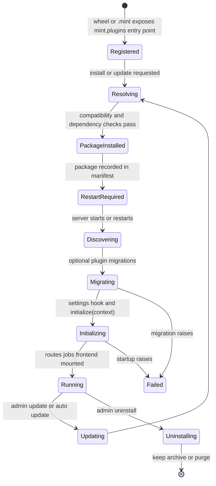

# Plugins

MINT is built around a plugin architecture. The platform itself stays small:
projects, experiments, members, plugins, and marketplace. Everything
lab-specific - LC-MS sequence design, drug-response prediction, chemical
drawing, importers, viewers - arrives as a plugin.

> [Screenshot: Admin -> Plugins group showing Installed and Registry sections, pending restart rows, and marketplace cards]

Think of the plugin system as five layers:

| Layer | What it owns |
|-------|--------------|
| **Package** | A Python wheel or `.mint` bundle with one `mint.plugins` entry point |
| **Runtime metadata** | The plugin's declared type, route prefix, capabilities, nav items, and config schema |
| **Install record** | The platform manifest and registry metadata stored under `server.dataPath` |
| **Runtime load** | Startup discovery, migrations, settings resolution, `initialize(context)`, route/job/frontend mounting |
| **Access and services** | Plugin roles, settings, jobs, notifications, calendar feeds, and uninstall cleanup |

## Plugin types

Each plugin has a type that sets its default experiment write policy. See [How plugins attach data](/guide/data-model#how-plugins-attach-data); developers see [Plugin types](/sdk/concepts/plugin-types).

## Plugin lifecycle

| Phase | What happens |
|-------|--------------|
| **Registered** | The package declares one `mint.plugins` entry point. Identity comes from PEP 621; runtime behavior comes from the plugin's declared metadata. |
| **Resolving** | Marketplace or upload install checks `min_platform_version`, bundle `[tool.mint].requires_mint`, the plugin's `mint-sdk` requirement against the platform's `mint-sdk`, and compiles the [plugin dependency lock](#plugin-dependency-lock). |
| **Package installed** | The wheel or `.mint` bundle is installed from the new lock, the source artifact is cached when needed, a manifest entry is written, and the previous lock is kept in the lock history for rollback. |
| **Restart required** | A successful install or update does not guarantee the new code is serving traffic yet. The package can appear as **Installed but not loaded yet** until the server restarts. |
| **Discovering** | On startup, MINT [reconciles the plugin lock](#startup-reconcile), restores missing manifest packages from their recorded wheels, imports loadable entry points, and keeps non-in-process manifest packages out of normal in-process discovery. A recorded wheel path that is absolute outside the data directory, or escapes it through `..`, is rejected: the plugin stays disabled and the rejection is logged. |
| **Migrating** | Optional plugin migrations run before the plugin initializes. A failure (Alembic or legacy) disables only that plugin; MINT keeps running. |
| **Initializing** | Decorator-declared config is resolved, `@on_config_change` startup hooks run, then `initialize(context)` runs if the plugin overrides it. |
| **Running** | Decorated endpoints, native routers, jobs, generated UI manifests, and frontend assets are mounted under the plugin route prefix. Admin UI shows **Running**, **Updating**, **Update ready**, **Migration failed**, **Disabled**, or **Pending restart**. |
| **Updating** | Updates repeat the install path against the newer package. The new code becomes active after the required restart/load cycle. |
| **Uninstalling** | The package and manifest entry are removed; plugin-owned data follows the selected cleanup mode. |

> [Screenshot: plugin lifecycle visualization with state pills]

For what the platform does at each phase from the plugin side, see [Lifecycle](/sdk/concepts/lifecycle). Capability flags are covered in [Plugin types](/sdk/concepts/plugin-types).

## Install steps

1. The marketplace service confirms the registry entry is compatible with the running platform version.
2. The plugin manager downloads the GitHub release asset matching `source.asset_pattern`.
3. If the asset is a `.mint` bundle, the platform checks the bundle manifest's `requires_mint` specifier unless the admin explicitly forces the install.
4. The plugin's `mint-sdk` requirement is checked against the platform's own `mint-sdk`. Plugins always run the platform's `mint-sdk`, so a plugin that excludes it is rejected, for example: `Plugin requires mint-sdk<1.3, platform has 1.3.0.` The same check runs for isolated installs and on startup restore.
5. The [plugin dependency lock](#plugin-dependency-lock) is recompiled with the new plugin. A lock that cannot be resolved blocks the install; a lock that changes or removes packages other plugins use is reported as a conflict (retry-with-force dialog).
6. The package or bundle is installed exactly as the new lock pins it, the source artifact is recorded for restore, and the previous lock is kept in the lock history.
7. The platform reports whether a restart is required before the plugin is loaded.
8. On startup, MINT discovers the entry point, applies migrations, resolves plugin settings, runs `initialize(context)`, and mounts endpoints, jobs, generated UI, and frontend assets.

If install fails, the operation reports the failing step and leaves the plugin uninstalled or requiring administrator cleanup, depending on where the failure occurred. Dependency conflicts surface as a retry-with-force dialog; use that only when you understand the dependency change.

Plugin installs (including installs from GitHub), upgrades, uninstalls, lock rollbacks, and plugin, platform and SDK updates run one at a time. A second operation waits until the first one finishes.

> [Screenshot: install progress dialog with each step ticking through]

After a successful install, check **Admin -> Plugins -> Installed**. A package can appear as
**Installed but not loaded yet** with a **Restart required** badge. It is not
serving plugin routes until the server restarts and the plugin reaches the
running state.

From **Admin -> Plugins -> Installed**, click **Uninstall** on a plugin to remove it; see [Uninstall modes](#uninstall-modes).

## Install requests

Users who have `plugins.view` but not `plugins.install` see **Request Install** in **Admin -> Plugins -> Registry** and enter a justification. The Registry section itself also needs `plugins.configure` or `plugins.install`, so a Member can file requests but a Viewer cannot reach the Registry.

Approving or denying a request is not in the web UI yet. A user with `plugins.install` uses the API:

| Action | Route |
|--------|-------|
| List requests | `GET /api/marketplace/requests` (admins see all; others see their own) |
| Approve (starts the install) | `POST /api/marketplace/requests/{id}/approve` |
| Deny | `POST /api/marketplace/requests/{id}/deny` |

Both review routes accept an optional `{"message": "..."}`. When authentication is disabled, filing a request returns 403 because there is no user account to attach it to.

## Plugin dependency lock

In-process plugins share the platform's Python environment. MINT controls what they install with a lock under `<server.dataPath>/plugins/locks/`:

| File | Contents |
|------|----------|
| `requirements.in` | One requirement per in-process plugin, in install order |
| `plugins.lock` | The hashed lock, compiled with `uv pip compile` using the platform's own lock as constraints. Platform-owned packages are omitted |
| `history/` | The 10 most recent previous locks, kept as rollback points |

Every install, upgrade and uninstall edits `requirements.in` and recompiles the lock:

- If the lock cannot be resolved, the operation is blocked and the resolver error is shown.
- The conflict report is the difference between the old and the new lock. When it would change or remove packages, the operation stops until you retry with force (`force=true` in the API). Downgrading a plugin also needs force.
- Packages that leave the lock are uninstalled.

### Source policy

| Source | Locked by |
|--------|-----------|
| Package index, wheel, `.mint` bundle | Version and hash |
| Git | Commit |
| Source distribution | Hash; marked not reproducible because it is built on install |
| Local path or editable install | Not locked; accepted only in dev mode |

### Startup reconcile

On every start, MINT brings the platform environment in line with the lock:

- On the first start without a lock, MINT locks the plugin versions currently installed.
- After a platform upgrade, MINT recompiles the lock. A plugin that no longer resolves is disabled: one that is incompatible with the new platform on its own, or, when two plugins conflict, the one installed later.
- MINT reinstalls locked packages that are missing (for example after a container rebuild). A plugin whose locked artifact cannot be reinstalled (missing local wheel, hash mismatch) is disabled.
- Outside dev mode, plugins from local or editable sources are disabled.

A disabled plugin appears at the bottom of **Admin -> Plugins -> Installed** as **Disabled by the dependency lock — `<package>`: `<reason>`**, and in `GET /api/plugins` under `dependency_lock`. Typical reasons start with `Plugin requires mint-sdk…`, `Incompatible with MINT <version>`, `Conflicts with earlier-installed plugin(s) …`, `Could not reinstall from the plugin lock`, or `Local and editable plugin sources are only allowed in dev mode.` Install a compatible plugin release, or uninstall the plugin from the row's action menu.

> [Screenshot: Admin -> Plugins -> Installed footer with a "Disabled by the dependency lock" row and its reason]

### Rollback

Rolling back applies a lock from `history/` and makes it current. There is no UI yet; use the API:

| Action | Route | Permission |
|--------|-------|------------|
| List history | `GET /api/plugins/snapshots` | `plugins.configure` |
| Show one entry | `GET /api/plugins/snapshots/{id}` | `plugins.configure` |
| Apply it | `POST /api/plugins/snapshots/{id}/rollback` | `plugins.install` |

A lock compiled for another platform version is refused, so rollback cannot undo a platform upgrade. Rollback restores Python packages only; it does not undo plugin database migrations.

## Isolation

Plugins run with one of two isolation strategies:

| Strategy | When | Mechanism |
|----------|------|-----------|
| **Shared environment** | When dependency sets are compatible | Plugin shares the platform's venv |
| **Per-plugin venv** | When the plugin's manifest entry installs it as a subprocess | `uv` creates a separate venv; plugin runs in a subprocess and the platform proxies HTTP to it |

A subprocess plugin gets its own hashed `plugin.lock` next to its persisted wheel, and its venv is installed and restored with `uv pip install --no-deps -r plugin.lock`. When that lock pins a different `mint-sdk` than the platform (after a platform upgrade), MINT recompiles it and rebuilds the venv.

In both cases the plugin's HTTP surface is mounted at the `routes_prefix` declared by the plugin. The user can't tell from the URL whether the plugin is in-process or out-of-process; the platform handles the proxy transparently.

Administrators can inspect isolated subprocesses from the server status view:
plugin name, status, port, start time, and restart count are shown in the
**Plugin processes** card.

The middleware in [`api/plugins/middleware.py`](https://github.com/MorscherLab/MINT/blob/v@MINT_VERSION@/api/plugins/middleware.py) wraps every plugin call with error isolation — a plugin crash never takes down the platform.

## Plugin migrations

Plugins that own database tables ship versioned migrations (see [Migrations](/sdk/concepts/migrations)). The admin UI surfaces:

- `schema_revision` — the plugin's currently applied revision (`schema_version` is deprecated, is null for Alembic plugins, and will be removed in 1.4)
- `pending_migrations` — revisions known to the plugin but not yet applied
- `migration_error` — the failure reason, if a migration crashed

If a migration fails, whether Alembic or legacy (`get_migrations_package()`), the plugin shows **Migration failed**, stays disabled, never reaches `initialize()`, and its routes are not mounted. Schema drift detected only against the plugin's models is shown as a warning badge and does not disable the plugin. The rest of MINT keeps running. Install a fixed plugin release and restart; the runner retries pending migrations.

## Update settings

**Admin -> Plugins -> Installed -> Advanced -> Update settings** edits the `updates` section of `config.json`: scheduled updates, the daily update time, the update scope (platform, plugins), background checks, the check interval, the platform repository and platform pre-releases. The **Advanced** card needs `plugins.configure`; the Update settings group needs `platform.configure`. See [Updates](/admin/updates) for what each setting does.

> [Screenshot: Admin -> Plugins -> Installed -> Advanced -> Update settings with Scheduled updates, Daily update time and Update scope]

## Uninstall modes

| Mode | What happens to data |
|------|----------------------|
| **keep** (current Admin UI / CLI behavior) | The package is uninstalled; plugin-owned tables and rows are kept in the database. Reinstalling the plugin can restore access. |
| **archive** (manager-level cleanup mode) | The plugin schema is renamed with an archived prefix. No code can read it automatically, but a database admin can recover it. |
| **purge** (manager-level cleanup mode) | The plugin schema is dropped after explicit confirmation. **Irreversible.** |

The current browser UI and `mint plugin uninstall` path use the safe
default: keep plugin data. The manager also tracks notification/calendar cleanup
work so plugin-owned service rows can be finalized even if an uninstall is
interrupted. Take a database backup before using lower-level cleanup paths or
manual schema removal.

## Plugin roles

Plugin roles are described in [Members & Roles → Plugin-specific roles](/admin/users-roles#plugin-specific-roles). Set a user's plugin role from **Admin -> Plugins ->
Installed -> plugin actions -> Access control**.

## Built-in plugins

The marketplace can advertise first-party and lab-local plugins. Names and availability depend on the registry configured for your deployment.

| Example plugin | Likely type | Role |
|----------------|-------------|------|
| MS experiment designer | `EXPERIMENT_DESIGN` or `FULL` | LC-MS sequence and plate-map design |
| RAW file uploader | `ANALYSIS` | RAW file upload, conversion, and result attachment |
| HMDB browser | `STATIC` or `ANALYSIS` | Metabolite lookup and annotation |
| Chemical drawing widget | `STATIC` | Chemical structure drawing or visualization |

The full catalog lives in the marketplace.

## Next

→ [Marketplace](/guide/marketplace) — discover, install, request, approve plugins
→ [Updates](/admin/updates) — keeping plugins and the platform fresh
→ [Plugin development guide](/sdk/) — `mint init`, `mint dev`, `mint build`
→ [SDK concepts](/sdk/concepts/) — what's in `mint-sdk` and how plugins integrate
