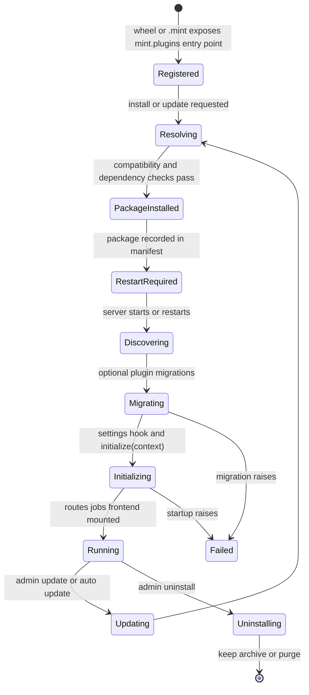

# Plugins

MINT is built around a plugin architecture. The platform itself stays small:
projects, experiments, members, plugins, and marketplace. Everything
lab-specific - LC-MS sequence design, drug-response prediction, chemical
drawing, importers, viewers - arrives as a plugin.

> [Screenshot: Admin -> Plugins group showing Installed and Registry sections, pending restart rows, and marketplace cards]

Think of the plugin system as five layers:

| Layer | What it owns |
|-------|--------------|
| **Package** | A Python wheel or `.mint` bundle with one `mint.plugins` entry point |
| **Runtime metadata** | The plugin's declared type, route prefix, capabilities, nav items, and config schema |
| **Install record** | The platform manifest and registry metadata stored under `server.dataPath` |
| **Runtime load** | Startup discovery, migrations, settings resolution, `initialize(context)`, route/job/frontend mounting |
| **Access and services** | Plugin roles, settings, jobs, notifications, calendar feeds, and uninstall cleanup |

## Plugin types

Each plugin has a type that sets its default experiment write policy. See [How plugins attach data](/guide/data-model#how-plugins-attach-data); developers see [Plugin types](/sdk/concepts/plugin-types).

## Plugin lifecycle

| Phase | What happens |
|-------|--------------|
| **Registered** | The package declares one `mint.plugins` entry point. Identity comes from PEP 621; runtime behavior comes from the plugin's declared metadata. |
| **Resolving** | Marketplace or upload install checks `min_platform_version`, bundle `[tool.mint].requires_mint`, dependency conflicts, and the running platform's `mint-sdk` version. |
| **Package installed** | The wheel or `.mint` bundle is installed, the source artifact is cached when needed, a manifest entry is written, and a Python-environment snapshot is kept for best-effort rollback. |
| **Restart required** | A successful install or update does not guarantee the new code is serving traffic yet. The package can appear as **Installed but not loaded yet** until the server restarts. |
| **Discovering** | On startup, MINT restores missing manifest packages, imports loadable entry points, and keeps non-in-process manifest packages out of normal in-process discovery. |
| **Migrating** | Optional plugin migrations run before startup. A migration failure blocks route mounting and surfaces in admin status. |
| **Initializing** | Decorator-declared config is resolved, `@on_config_change` startup hooks run, then `initialize(context)` runs if the plugin overrides it. |
| **Running** | Decorated endpoints, native routers, jobs, generated UI manifests, and frontend assets are mounted under the plugin route prefix. Admin UI shows **Running**, **Update ready**, **Disabled**, or **Pending restart**. |
| **Updating** | Updates repeat the install path against the newer package. The new code becomes active after the required restart/load cycle. |
| **Uninstalling** | The package and manifest entry are removed; plugin-owned data follows the selected cleanup mode. |

> [Screenshot: plugin lifecycle visualization with state pills]

For what the platform does at each phase from the plugin side, see [Lifecycle](/sdk/concepts/lifecycle). Capability flags are covered in [Plugin types](/sdk/concepts/plugin-types).

## Install steps

1. The marketplace service confirms the registry entry is compatible with the running platform version.
2. The plugin manager downloads the GitHub release asset matching `source.asset_pattern`.
3. If the asset is a `.mint` bundle, the platform checks the bundle manifest's `requires_mint` specifier unless the admin explicitly forces the install.
4. The install path pins `mint-sdk` to the platform's own version so a plugin cannot silently upgrade or downgrade the platform SDK.
5. Dependency preflight checks whether the plugin can share the platform environment. Conflicts are reported as a retry-with-force dialog.
6. The package or bundle is installed, the source artifact is recorded for restore, and a snapshot is kept for best-effort Python package rollback.
7. The platform reports whether a restart is required before the plugin is loaded.
8. On startup, MINT discovers the entry point, applies migrations, resolves plugin settings, runs `initialize(context)`, and mounts endpoints, jobs, generated UI, and frontend assets.

If install fails, the operation reports the failing step and leaves the plugin uninstalled or requiring administrator cleanup, depending on where the failure occurred. Dependency conflicts surface as a retry-with-force dialog; use that only when you understand the dependency change.

> [Screenshot: install progress dialog with each step ticking through]

After a successful install, check **Admin -> Plugins -> Installed**. A package can appear as
**Installed but not loaded yet** with a **Restart required** badge. It is not
serving plugin routes until the server restarts and the plugin reaches the
running state.

From **Admin -> Plugins -> Installed**, click **Uninstall** on a plugin to remove it; see [Uninstall modes](#uninstall-modes).

## Isolation

Plugins run with one of two isolation strategies:

| Strategy | When | Mechanism |
|----------|------|-----------|
| **Shared environment** | When dependency sets are compatible | Plugin shares the platform's venv |
| **Per-plugin venv** | When the manifest/runtime installs the plugin as a subprocess because dependency isolation is needed | `uv` creates a separate venv; plugin runs in a subprocess and the platform proxies HTTP to it |

In both cases the plugin's HTTP surface is mounted at the `routes_prefix` declared by the plugin. The user can't tell from the URL whether the plugin is in-process or out-of-process; the platform handles the proxy transparently.

Administrators can inspect isolated subprocesses from the server status view:
plugin name, status, port, start time, and restart count are shown in the
**Plugin processes** card.

The middleware in [`api/plugins/middleware.py`](https://github.com/MorscherLab/MINT/blob/main/api/plugins/middleware.py) wraps every plugin call with error isolation — a plugin crash never takes down the platform.

## Plugin migrations

Plugins that own database tables ship versioned migrations (see [Migrations](/sdk/concepts/migrations)). The admin UI surfaces:

- `schema_version` — the plugin's currently applied revision
- `pending_migrations` — revisions known to the plugin but not yet applied
- `migration_error` — the failure reason, if a migration crashed

If a migration fails, the plugin stays in an `error` state and its routes are not mounted. Fix the migration, reload the plugin, and the runner retries.

## Uninstall modes

| Mode | What happens to data |
|------|----------------------|
| **keep** (current Admin UI / CLI behavior) | The package is uninstalled; plugin-owned tables and rows are kept in the database. Reinstalling the plugin can restore access. |
| **archive** (manager-level cleanup mode) | The plugin schema is renamed with an archived prefix. No code can read it automatically, but a database admin can recover it. |
| **purge** (manager-level cleanup mode) | The plugin schema is dropped after explicit confirmation. **Irreversible.** |

The current browser UI and `mint plugin uninstall` path use the safe
default: keep plugin data. The manager also tracks notification/calendar cleanup
work so plugin-owned service rows can be finalized even if an uninstall is
interrupted. Take a database backup before using lower-level cleanup paths or
manual schema removal.

## Plugin roles

Plugin roles are described in [Members & Roles → Plugin-specific roles](/admin/users-roles#plugin-specific-roles). Set a user's plugin role from **Admin -> Plugins ->
Installed -> plugin actions -> Access control**.

## Built-in plugins

The marketplace can advertise first-party and lab-local plugins. Names and availability depend on the registry configured for your deployment.

| Example plugin | Likely type | Role |
|----------------|-------------|------|
| MS experiment designer | `EXPERIMENT_DESIGN` or `FULL` | LC-MS sequence and plate-map design |
| RAW file uploader | `ANALYSIS` | RAW file upload, conversion, and result attachment |
| HMDB browser | `STATIC` or `ANALYSIS` | Metabolite lookup and annotation |
| Chemical drawing widget | `STATIC` | Chemical structure drawing or visualization |

The full catalog lives in the marketplace.

## Next

→ [Marketplace](/guide/marketplace) — discover, install, request, approve plugins
→ [Updates](/admin/updates) — keeping plugins and the platform fresh
→ [Plugin development guide](/sdk/) — `mint init`, `mint dev`, `mint build`
→ [SDK concepts](/sdk/concepts/) — what's in `mint-sdk` and how plugins integrate
