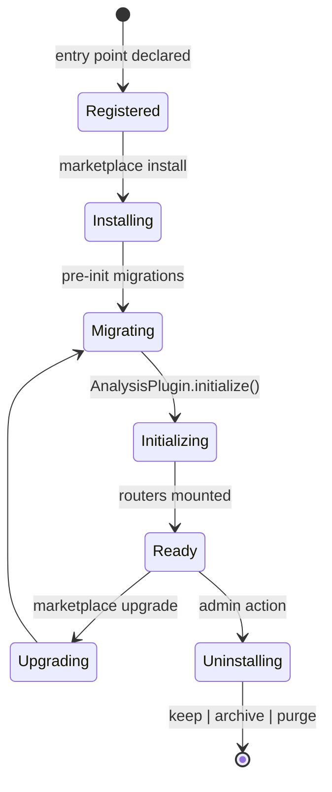

# MINT-docs SDK deepening — implementation plan

> **For agentic workers:** REQUIRED SUB-SKILL: Use superpowers:executing-plans to implement this plan task-by-task. Steps use checkbox (`- [ ]`) syntax for tracking.

**Goal:** Deepen MINT-docs to be the single source of truth for both the user manual and the SDK reference, by adding 43 new `/sdk/` pages organized into a Plugin Development track (Concepts → Tutorials → Recipes → Frontend → Operations → API Reference), restructuring top nav into User Manual / Plugin Development / Reference tracks, and retiring the three lightweight `/sdk/*.md` placeholders.

**Architecture:** Two-track VitePress site sharing one config and theme. Sidebars are per-prefix; top nav splits cleanly between User Manual and Plugin Development. SDK content is rewritten into MINT-docs from existing material at `mld-platform/mld/site/` and the live SDK source at `mld-platform/mld/packages/sdk-{python,frontend}/`. Code examples are runnable; diagrams are Mermaid where structural, ASCII where simple.

**Tech Stack:** VitePress 1.6 + Bun + Markdown + Mermaid. Source material from `mld-platform/mld/site/**/*.md` and `mld-platform/mld/packages/sdk-python/src/mint_sdk/` and `mld-platform/mld/packages/sdk-frontend/src/`.

**Spec:** `docs/superpowers/specs/2026-05-01-mint-docs-sdk-deepening-design.md`

---

## Pre-flight

### Task 0: Initialize git and capture baseline

**Files:**
- Modify: working tree at `/Users/estrella/Developer/MorscherLab/MINT-docs/`

- [ ] **Step 0.1: Init git, configure ignore, snapshot the current docs as a clean baseline**

```bash
cd /Users/estrella/Developer/MorscherLab/MINT-docs
git init
git add -A
git commit -m "chore: scaffold MINT-docs from LEAF-docs template (pre-SDK-deepening baseline)

Co-Authored-By: Claude Opus 4.7 (1M context) <noreply@anthropic.com>"
```

Expected: `git status` reports clean tree.

- [ ] **Step 0.2: Verify build is green before any further changes**

Run: `bun run build`
Expected: `build complete` with no warnings or errors.

---

## Task 1: Source-material scan

**Files:**
- Read-only research; nothing written yet.

- [ ] **Step 1.1: Inventory the SDK source surface**

Read these files and record the exported symbols + a one-line description per symbol in scratch notes:

```
/Users/estrella/Developer/MorscherLab/mld-platform/mld/packages/sdk-python/src/mint_sdk/__init__.py
/Users/estrella/Developer/MorscherLab/mld-platform/mld/packages/sdk-python/src/mint_sdk/plugin.py
/Users/estrella/Developer/MorscherLab/mld-platform/mld/packages/sdk-python/src/mint_sdk/context.py
/Users/estrella/Developer/MorscherLab/mld-platform/mld/packages/sdk-python/src/mint_sdk/models.py
/Users/estrella/Developer/MorscherLab/mld-platform/mld/packages/sdk-python/src/mint_sdk/repositories.py
/Users/estrella/Developer/MorscherLab/mld-platform/mld/packages/sdk-python/src/mint_sdk/exceptions.py
/Users/estrella/Developer/MorscherLab/mld-platform/mld/packages/sdk-python/src/mint_sdk/migrations/__init__.py
/Users/estrella/Developer/MorscherLab/mld-platform/mld/packages/sdk-python/src/mint_sdk/client/__init__.py
/Users/estrella/Developer/MorscherLab/mld-platform/mld/packages/sdk-python/src/mint_sdk/cli.py
```

Capture: every public class, every public function, every public type. This is the basis for accurate API examples — no invented symbol names anywhere.

- [ ] **Step 1.2: Inventory frontend SDK exports**

```
/Users/estrella/Developer/MorscherLab/mld-platform/mld/packages/sdk-frontend/src/index.ts
/Users/estrella/Developer/MorscherLab/mld-platform/mld/packages/sdk-frontend/src/components/index.ts
/Users/estrella/Developer/MorscherLab/mld-platform/mld/packages/sdk-frontend/src/composables/index.ts
```

List every component name and every composable name. Pick the top 20 components by likely usage (App* layout primitives, Form / Modal / Card / Button basics, domain widgets like WellPlate / PlateMapEditor / FormBuilder / ChemicalFormula).

- [ ] **Step 1.3: Skim existing dev-site pages**

Read each of these as raw material for the rewrite (do not edit them):

```
/Users/estrella/Developer/MorscherLab/mld-platform/mld/site/sdk/{api-reference,best-practices,core-concepts,data-models,deployment,design-rules,error-handling,frontend-sdk,guides,index,publishing,repositories}.md
/Users/estrella/Developer/MorscherLab/mld-platform/mld/site/python/{api-reference,exceptions,plugin-guide,plugin-migrations,r-integration}.md
/Users/estrella/Developer/MorscherLab/mld-platform/mld/site/frontend/{api-reference,components,composables,theming}.md
/Users/estrella/Developer/MorscherLab/mld-platform/mld/site/guide/{building-plugins,getting-started,plugin-development,sdk-plugin-development-guide}.md
/Users/estrella/Developer/MorscherLab/mld-platform/mld/site/cli/{client,commands}.md
```

Note where each existing page maps in the new IA (per the spec's mapping table). Record any technical details (config keys, env vars, error codes, naming conventions) that need to be preserved verbatim.

- [ ] **Step 1.4: Commit research notes (none — research only)**

No write needed. Move to Task 2.

---

## Task 2: Sidebar / nav skeleton

**Files:**
- Modify: `.vitepress/config.ts`

- [ ] **Step 2.1: Add the `/sdk/` sidebar groups to `config.ts`**

In `.vitepress/config.ts`, replace the existing `'/sdk/'` sidebar entry with the full six-section tree. Each `link` will be created by later tasks; pre-wiring is fine because VitePress only validates internal links *inside rendered markdown*, not sidebar entries.

```typescript
// .vitepress/config.ts — replace the existing '/sdk/' entry inside themeConfig.sidebar
'/sdk/': [
  {
    text: 'Concepts',
    items: [
      { text: 'Overview', link: '/sdk/concepts/' },
      { text: 'Plugin types', link: '/sdk/concepts/plugin-types' },
      { text: 'Plugin lifecycle', link: '/sdk/concepts/lifecycle' },
      { text: 'Isolation', link: '/sdk/concepts/isolation' },
      { text: 'PlatformContext', link: '/sdk/concepts/platform-context' },
      { text: 'Data model', link: '/sdk/concepts/data-model' },
      { text: 'Migrations', link: '/sdk/concepts/migrations' },
    ],
  },
  {
    text: 'Tutorials',
    items: [
      { text: 'Overview', link: '/sdk/tutorials/' },
      { text: 'First analysis plugin', link: '/sdk/tutorials/first-analysis-plugin' },
      { text: 'Design plugin with tables', link: '/sdk/tutorials/design-plugin-with-tables' },
      { text: 'Adding a frontend', link: '/sdk/tutorials/adding-a-frontend' },
      { text: 'Plugin roles', link: '/sdk/tutorials/plugin-roles' },
    ],
  },
  {
    text: 'Recipes',
    items: [
      { text: 'Overview', link: '/sdk/recipes/' },
      { text: 'Reading experiments', link: '/sdk/recipes/reading-experiments' },
      { text: 'Writing results', link: '/sdk/recipes/writing-results' },
      { text: 'Managing artifacts', link: '/sdk/recipes/managing-artifacts' },
      { text: 'Querying plugin data', link: '/sdk/recipes/querying-plugin-data' },
      { text: 'Route permissions', link: '/sdk/recipes/route-permissions' },
      { text: 'Error handling', link: '/sdk/recipes/error-handling' },
      { text: 'Logging & tracing', link: '/sdk/recipes/logging-tracing' },
      { text: 'Testing plugins', link: '/sdk/recipes/testing-plugins' },
      { text: 'Backfill migrations', link: '/sdk/recipes/backfill-migration' },
      { text: 'R integration', link: '/sdk/recipes/r-integration' },
    ],
  },
  {
    text: 'Frontend',
    items: [
      { text: 'Overview', link: '/sdk/frontend/' },
      { text: 'Components', link: '/sdk/frontend/components' },
      { text: 'Composables', link: '/sdk/frontend/composables' },
      { text: 'Design tokens', link: '/sdk/frontend/design-tokens' },
      { text: 'Theming', link: '/sdk/frontend/theming' },
      { text: 'FormBuilder', link: '/sdk/frontend/form-builder' },
    ],
  },
  {
    text: 'Operations',
    items: [
      { text: 'Overview', link: '/sdk/operations/' },
      { text: 'Packaging', link: '/sdk/operations/packaging' },
      { text: 'Publishing', link: '/sdk/operations/publishing' },
      { text: 'CI patterns', link: '/sdk/operations/ci-patterns' },
      { text: 'Versioning', link: '/sdk/operations/versioning' },
      { text: 'Deploying', link: '/sdk/operations/deploying' },
      { text: 'Upgrading the SDK', link: '/sdk/operations/upgrading-sdk' },
    ],
  },
  {
    text: 'API Reference',
    items: [
      { text: 'Overview', link: '/sdk/api/' },
      { text: 'Python SDK', link: '/sdk/api/python' },
      { text: 'Frontend SDK', link: '/sdk/api/frontend' },
      { text: 'Migrations', link: '/sdk/api/migrations' },
      { text: 'REST client', link: '/sdk/api/client' },
      { text: 'Exceptions', link: '/sdk/api/exceptions' },
      { text: 'CLI reference', link: '/sdk/api/cli-reference' },
    ],
  },
],
```

- [ ] **Step 2.2: Update top-nav to two-track structure**

Replace the existing `nav` array in `themeConfig` with:

```typescript
nav: [
  {
    text: 'User Manual',
    items: [
      { text: 'Get Started', link: '/get-started/install-direct' },
      { text: 'Guide', link: '/workflow/projects' },
      { text: 'CLI', link: '/cli/overview' },
    ],
  },
  {
    text: 'Plugin Development',
    items: [
      { text: 'Concepts', link: '/sdk/concepts/' },
      { text: 'Tutorials', link: '/sdk/tutorials/' },
      { text: 'Recipes', link: '/sdk/recipes/' },
      { text: 'Frontend', link: '/sdk/frontend/' },
      { text: 'Operations', link: '/sdk/operations/' },
      { text: 'API Reference', link: '/sdk/api/' },
    ],
  },
  { text: 'Reference', link: '/reference/ui-tour' },
  {
    text: 'More',
    items: [
      { text: 'Team', link: '/team' },
      { text: 'Changelog', link: '/changelog' },
      { text: 'Source code', link: 'https://github.com/MorscherLab/mld' },
    ],
  },
  { text: 'Open MINT', link: 'https://mint.morscherlab.org' },
],
```

- [ ] **Step 2.3: Build (will fail because /sdk/ pages don't exist yet)**

Run: `bun run build`
Expected: build fails with 404 dead links pointing to `/sdk/concepts/`, `/sdk/tutorials/`, etc. Confirming this *should* fail tells us the wiring took effect; we'll write the index pages immediately in Task 3.

- [ ] **Step 2.4: Commit**

```bash
git add .vitepress/config.ts
git commit -m "feat(nav): scaffold two-track top nav and /sdk/ sidebar tree

Pre-wires sidebar and nav for the Plugin Development track. /sdk/
pages don't exist yet — build will fail until Task 3 writes the
section indexes. This commit is the structural skeleton only.

Co-Authored-By: Claude Opus 4.7 (1M context) <noreply@anthropic.com>"
```

---

## Task 3: Concepts (7 pages)

**Files (all to create):**
- `sdk/concepts/index.md`
- `sdk/concepts/plugin-types.md`
- `sdk/concepts/lifecycle.md`
- `sdk/concepts/isolation.md`
- `sdk/concepts/platform-context.md`
- `sdk/concepts/data-model.md`
- `sdk/concepts/migrations.md`

Source material to fold in (use the inventory from Task 1):
- `mld/site/sdk/core-concepts.md`, `mld/site/sdk/data-models.md`, `mld/site/sdk/repositories.md`
- `mld/site/python/plugin-migrations.md`
- SDK source for accurate symbol names

- [ ] **Step 3.1: `sdk/concepts/index.md` — landing page**

Cover: what's in the Concepts section, recommended reading order, link to Tutorials for a hands-on intro instead. ~150 words. End with a "Next: [Plugin types](/sdk/concepts/plugin-types)" pointer.

- [ ] **Step 3.2: `sdk/concepts/plugin-types.md`**

Three plugin types: `EXPERIMENT_DESIGN`, `ANALYSIS`, `TOOL`. Table comparing what each owns / writes / reads. Include short example `PluginMetadata` declarations for each. Use real symbols from `mint_sdk.models`. Cross-link to `/sdk/tutorials/first-analysis-plugin` and `/sdk/tutorials/design-plugin-with-tables`.

- [ ] **Step 3.3: `sdk/concepts/lifecycle.md`**

Phases: register → install → migrate → initialize → ready → upgrade → uninstall. Mermaid state diagram. Per-phase: what the platform does, what hooks the plugin can implement (`initialize`, `shutdown`, `get_migrations_package`), what state is reachable. Link to `/sdk/concepts/migrations`.



- [ ] **Step 3.4: `sdk/concepts/isolation.md`**

Two strategies: shared environment vs per-plugin venv. When each kicks in (`conflict.py` decision). How subprocess proxying works (`subprocess_manager.py` + `proxy.py` / `dev_proxy.py`). Mermaid sequence diagram of a request hitting an isolated plugin. Trade-offs.

- [ ] **Step 3.5: `sdk/concepts/platform-context.md`**

`PlatformContext` is the single dependency a plugin gets. Enumerate accessors with one-line descriptions: `get_experiment_repository`, `get_project_repository`, `get_user_repository`, `get_artifact_repository`, `get_plugin_data_repository`, `current_user`, `tracer`. Show a minimal handler that uses two of them. Capability gating — declared capabilities determine which accessors actually return data.

- [ ] **Step 3.6: `sdk/concepts/data-model.md`**

Core entities and how plugins relate to them: `Project`, `Experiment` (with `experiment_code`, `design_data`, `analysis_results`, `collaborators`), `Artifact`, `User`, `UserPluginRole`, `PluginInstallRequest`, `PluginSchemaMigration`. ER-style table or list with the fields plugins typically read/write. Note JSONB portability across Postgres/SQLite.

- [ ] **Step 3.7: `sdk/concepts/migrations.md`**

Per-plugin schema evolution via `mint_sdk.migrations`. `PluginMigration`, `MigrationOps` (portable DDL: `add_column`, `drop_column`, `create_table`, `rename_column`, `create_index`), `MigrationRunner`. Advisory-locked execution. Migration revisions are append-only — never edit applied revisions. Sample migration. Cross-link to `/sdk/recipes/backfill-migration`.

- [ ] **Step 3.8: Build green**

Run: `bun run build`
Expected: build passes. Concepts pages exist; Tutorials / Recipes / etc. still 404 from sidebar links but those don't appear in any rendered page yet.

- [ ] **Step 3.9: Commit**

```bash
git add sdk/concepts/
git commit -m "docs(sdk): add Concepts section (7 pages)

Plugin types, lifecycle, isolation, PlatformContext, data model,
and migrations. Mermaid diagrams for lifecycle and isolation flow.
All examples use real symbols from packages/sdk-python.

Co-Authored-By: Claude Opus 4.7 (1M context) <noreply@anthropic.com>"
```

---

## Task 4: Tutorials (5 pages)

**Files (all to create):**
- `sdk/tutorials/index.md`
- `sdk/tutorials/first-analysis-plugin.md`
- `sdk/tutorials/design-plugin-with-tables.md`
- `sdk/tutorials/adding-a-frontend.md`
- `sdk/tutorials/plugin-roles.md`

Source material:
- `mld/site/guide/getting-started.md`, `building-plugins.md`, `plugin-development.md`, `sdk-plugin-development-guide.md`
- `mld/site/sdk/best-practices.md`

- [ ] **Step 4.1: `sdk/tutorials/index.md`**

What each tutorial covers, how long it takes, prerequisites (a working `mint` install + Python 3.12 + bun for frontend). Recommend reading Concepts first.

- [ ] **Step 4.2: `sdk/tutorials/first-analysis-plugin.md`**

End-to-end build of a hello-world analysis plugin. Sections:
1. Scaffold with `mint init my-plugin --type analysis`
2. Inspect the generated layout
3. Implement the `metadata` property and a `/hello` route
4. Run with `mint dev --platform`
5. Open in the browser, hit the route
6. Add a route that reads an experiment via `PlatformContext`
7. Add a unit test using the SDK testing harness
8. `mint build` produces a `.mint` bundle

Every code block runnable. Each file path explicit. ~600 words + ~120 lines of code.

- [ ] **Step 4.3: `sdk/tutorials/design-plugin-with-tables.md`**

End-to-end build of a design plugin with its own database table. Sections:
1. Scaffold with `mint init my-design --type experiment-design --with-migrations`
2. Define the experiment type's design schema (Pydantic)
3. Write the v001 migration (create the table)
4. Implement CRUD routes that write `design_data` and the owned table
5. Run, test, package

- [ ] **Step 4.4: `sdk/tutorials/adding-a-frontend.md`**

Add a Vue 3 frontend to the analysis plugin from tutorial 4.2. Sections:
1. Scaffold the frontend (the `mint init` template already includes it; show the structure)
2. Use `AppLayout`, `Card`, `useApi` from `@morscherlab/mint-sdk`
3. Hit the plugin's API from the frontend
4. Run with `mint dev --platform` (hot reload across both)
5. Build for production via `mint build`

- [ ] **Step 4.5: `sdk/tutorials/plugin-roles.md`**

Define a plugin-internal role enum (`UserPluginRole`) and gate routes / UI by it. Walks through:
1. Define an enum in the plugin
2. Register it in `PluginMetadata.capabilities`
3. Write a guard dependency that checks the user's plugin role
4. Show how admins assign roles per user under **Admin → Plugins → \<plugin> → Users**
5. Frontend: hide UI when the role is missing

- [ ] **Step 4.6: Build green + commit**

```bash
bun run build
git add sdk/tutorials/
git commit -m "docs(sdk): add Tutorials section (5 pages)

End-to-end walkthroughs: first analysis plugin, design plugin with
tables, adding a frontend, plugin roles. All code examples use real
mint-sdk symbols and mint CLI commands.

Co-Authored-By: Claude Opus 4.7 (1M context) <noreply@anthropic.com>"
```

---

## Task 5: Recipes (11 pages)

**Files (all to create):**
- `sdk/recipes/index.md`
- `sdk/recipes/reading-experiments.md`
- `sdk/recipes/writing-results.md`
- `sdk/recipes/managing-artifacts.md`
- `sdk/recipes/querying-plugin-data.md`
- `sdk/recipes/route-permissions.md`
- `sdk/recipes/error-handling.md`
- `sdk/recipes/logging-tracing.md`
- `sdk/recipes/testing-plugins.md`
- `sdk/recipes/backfill-migration.md`
- `sdk/recipes/r-integration.md`

Source material:
- `mld/site/sdk/repositories.md`, `mld/site/sdk/error-handling.md`, `mld/site/sdk/best-practices.md`
- `mld/site/python/exceptions.md`, `mld/site/python/r-integration.md`
- SDK source for repositories, exceptions, testing harness

Each recipe page:
- 100–250 words
- 1–3 focused code blocks
- Cross-link to relevant Concept page and Tutorial
- Pattern: "Goal → Code → Notes → Related"

- [ ] **Step 5.1: `sdk/recipes/index.md`** — table of contents grouped by topic; goal-oriented index ("How do I…")

- [ ] **Step 5.2: `sdk/recipes/reading-experiments.md`** — `PlatformContext.get_experiment_repository()`; pagination; filtering by status/project/owner; reading `design_data` and `analysis_results`

- [ ] **Step 5.3: `sdk/recipes/writing-results.md`** — `experiments.update_analysis_results()` (or actual symbol from source); idempotency; per-run keys

- [ ] **Step 5.4: `sdk/recipes/managing-artifacts.md`** — uploading via the artifact repo; reading back; size limits; signed URL pattern

- [ ] **Step 5.5: `sdk/recipes/querying-plugin-data.md`** — using the plugin's own scoped storage; SQLAlchemy patterns; index tuning

- [ ] **Step 5.6: `sdk/recipes/route-permissions.md`** — `require_permission("resource.action")` from `api/dependencies/permissions.py`; combining with plugin roles; testing guards

- [ ] **Step 5.7: `sdk/recipes/error-handling.md`** — `mint_sdk.exceptions` taxonomy; mapping to HTTP responses; the auto-issue feature; user-facing vs developer-facing messages

- [ ] **Step 5.8: `sdk/recipes/logging-tracing.md`** — `mint_sdk.logging.get_logger()`; structured fields auto-attached (request ID, user ID, plugin name); custom OpenTelemetry spans via the context's tracer

- [ ] **Step 5.9: `sdk/recipes/testing-plugins.md`** — `mint_sdk.testing` harness; fixtures for `PlatformContext`; in-memory repos; pytest setup snippet

- [ ] **Step 5.10: `sdk/recipes/backfill-migration.md`** — patterns for migrations that compute values from existing rows; chunked updates; idempotency on retry

- [ ] **Step 5.11: `sdk/recipes/r-integration.md`** — calling R from a Python plugin via `rpy2` or subprocess; passing data frames; lifecycle considerations

- [ ] **Step 5.12: Build green + commit**

```bash
bun run build
git add sdk/recipes/
git commit -m "docs(sdk): add Recipes section (11 pages)

Goal-oriented copy-paste patterns: reading experiments, writing
results, artifacts, plugin data, permissions, errors, logging,
testing, backfill migrations, R integration.

Co-Authored-By: Claude Opus 4.7 (1M context) <noreply@anthropic.com>"
```

---

## Task 6: Frontend (6 pages)

**Files (all to create):**
- `sdk/frontend/index.md`
- `sdk/frontend/components.md`
- `sdk/frontend/composables.md`
- `sdk/frontend/design-tokens.md`
- `sdk/frontend/theming.md`
- `sdk/frontend/form-builder.md`

Source material:
- `mld/site/frontend/{components,composables,theming,api-reference}.md`
- `packages/sdk-frontend/src/components/index.ts`, `composables/index.ts`, `styles/variables.css`

- [ ] **Step 6.1: `sdk/frontend/index.md`** — what's in `@morscherlab/mint-sdk`; Tailwind preset setup; Histoire pointer

- [ ] **Step 6.2: `sdk/frontend/components.md`** — top-20 catalog; per-component card with: import path, props summary, one minimal usage block, link to source on GitHub. The 20: `AppLayout`, `AppTopBar`, `AppSidebar`, `AppAvatarMenu`, `BaseButton`, `BaseInput`, `BaseModal`, `BaseCheckbox`, `BasePill`, `Card`, `AlertBox`, `Avatar`, `AuditTrail`, `WellPlate`, `PlateMapEditor`, `FormBuilder`, `ChemicalFormula`, `MoleculeInput`, `DoseCalculator`, `StepWizard`. Acknowledge ~96 total components and link to Histoire / source for the rest.

- [ ] **Step 6.3: `sdk/frontend/composables.md`** — full list (~27) with one-line descriptions; deep-dive blocks for `useApi`, `useAuth`, `usePlatformContext`, `useExperimentSelector`, `useExperimentData`, `useFormBuilder`, `useToast`

- [ ] **Step 6.4: `sdk/frontend/design-tokens.md`** — CSS variable families (`--color-primary*`, `--color-cta*`, `--mint-{success,error,warning,info}`, `--bg-*`, `--text-*`, `--focus-ring`); Tailwind preset usage; do-not-hardcode rule

- [ ] **Step 6.5: `sdk/frontend/theming.md`** — light / dark, palette overrides, density, prefers-reduced-motion, accessibility (WCAG AA targets)

- [ ] **Step 6.6: `sdk/frontend/form-builder.md`** — `FormBuilder` + `useFormBuilder` deep dive: schema format, validation, custom widgets, integration with experiment design

- [ ] **Step 6.7: Build green + commit**

```bash
bun run build
git add sdk/frontend/
git commit -m "docs(sdk): add Frontend section (6 pages)

Components catalog (top 20 + pointers), composables (full list +
deep dives on the 7 most-used), design tokens, theming, FormBuilder
deep dive. ~96 total components acknowledged with Histoire / source
pointers for completeness.

Co-Authored-By: Claude Opus 4.7 (1M context) <noreply@anthropic.com>"
```

---

## Task 7: Operations (7 pages)

**Files (all to create):**
- `sdk/operations/index.md`
- `sdk/operations/packaging.md`
- `sdk/operations/publishing.md`
- `sdk/operations/ci-patterns.md`
- `sdk/operations/versioning.md`
- `sdk/operations/deploying.md`
- `sdk/operations/upgrading-sdk.md`

Source material:
- `mld/site/sdk/{publishing,deployment,best-practices}.md`

- [ ] **Step 7.1: `sdk/operations/index.md`** — what each ops page covers; chronology (build → publish → install → upgrade)

- [ ] **Step 7.2: `sdk/operations/packaging.md`** — `mint build` mechanics; `.mint` bundle structure (zipped wheel + frontend assets + metadata); flags (`--no-frontend`, `--output`, `--check`)

- [ ] **Step 7.3: `sdk/operations/publishing.md`** — PyPI publish flow; npm publish flow for frontend SDK consumers (rare); marketplace registry submission (JSON shape, hosting requirements)

- [ ] **Step 7.4: `sdk/operations/ci-patterns.md`** — GitHub Actions templates: build-on-PR, publish-on-tag (PyPI + GHCR registry feed), test-on-matrix (Python 3.12 / 3.13). Pull from existing plugin repos' workflows where templates exist.

- [ ] **Step 7.5: `sdk/operations/versioning.md`** — SemVer for plugins; `hatch-vcs` from git tags; declaring SDK compat ranges in `PluginMetadata` (`mint-sdk = ">=1.0.0,<2.0.0"`); how the marketplace's compatibility check works

- [ ] **Step 7.6: `sdk/operations/deploying.md`** — direct vs Docker deployment of the platform with installed plugins; isolation tradeoffs; storage volumes; observability; backup

- [ ] **Step 7.7: `sdk/operations/upgrading-sdk.md`** — `mint update` for plugin authors; reading the SDK changelog; handling SDK-major breaks (deprecation cycle, migration path)

- [ ] **Step 7.8: Build green + commit**

```bash
bun run build
git add sdk/operations/
git commit -m "docs(sdk): add Operations section (7 pages)

Packaging, publishing, CI patterns, versioning, deploying, upgrading
the SDK. Concrete GitHub Actions templates and SemVer rules.

Co-Authored-By: Claude Opus 4.7 (1M context) <noreply@anthropic.com>"
```

---

## Task 8: API Reference (7 pages)

**Files (all to create):**
- `sdk/api/index.md`
- `sdk/api/python.md`
- `sdk/api/frontend.md`
- `sdk/api/migrations.md`
- `sdk/api/client.md`
- `sdk/api/exceptions.md`
- `sdk/api/cli-reference.md`

Source material:
- `mld/site/sdk/api-reference.md`, `mld/site/python/api-reference.md`, `mld/site/python/exceptions.md`
- `mld/site/frontend/api-reference.md`
- `mld/site/cli/{client,commands}.md`
- SDK source for accuracy

The API Reference is intentionally back-of-book — short, factual, well-cross-linked to source on GitHub. Not exhaustive prop / method tables for everything (that's what the source is for).

- [ ] **Step 8.1: `sdk/api/index.md`** — what's covered here; pointer to GitHub source for things not enumerated

- [ ] **Step 8.2: `sdk/api/python.md`** — every public symbol from `mint_sdk.__init__`, with one-line description and link to source. Group by area (Plugin, Context, Models, Repos, Migrations, Exceptions, Logging, Testing).

- [ ] **Step 8.3: `sdk/api/frontend.md`** — exported components and composables tables (name, one-line summary, source link). Defer detailed prop / arg signatures to Histoire and TypeScript source.

- [ ] **Step 8.4: `sdk/api/migrations.md`** — `PluginMigration`, `MigrationOps`, `MigrationRunner` with method signatures and the portable DDL methods on `MigrationOps`

- [ ] **Step 8.5: `sdk/api/client.md`** — `MintClient`, factory methods (`from_env`, explicit constructor), method tables (experiments, projects, plugins, status)

- [ ] **Step 8.6: `sdk/api/exceptions.md`** — full taxonomy, when raised, HTTP mapping

- [ ] **Step 8.7: `sdk/api/cli-reference.md`** — every `mint` subcommand and flag, alphabetized; the canonical reference. Pulls from `mint --help` output structure.

- [ ] **Step 8.8: Build green + commit**

```bash
bun run build
git add sdk/api/
git commit -m "docs(sdk): add API Reference section (7 pages)

Back-of-book reference: Python SDK exports, frontend exports,
migrations, REST client, exceptions, CLI flags. Each page links
to GitHub source for symbol-by-symbol detail.

Co-Authored-By: Claude Opus 4.7 (1M context) <noreply@anthropic.com>"
```

---

## Task 9: Cross-cutting cleanup

**Files:**
- Modify: `index.md`, `cli/plugin-dev.md`, `workflow/plugins.md`, `workflow/marketplace.md`, `workflow/updates.md`, `cli/overview.md`
- Delete: `sdk/overview.md`, `sdk/python.md`, `sdk/frontend.md`

- [ ] **Step 9.1: Add the Plugin Author CTA to `index.md`**

In the `actions` array of the home hero, add a third action above the existing two:

```yaml
    - theme: alt
      text: For plugin authors
      link: /sdk/concepts/
```

Reorder so Get Started is brand, then For plugin authors, then Quickstart, then Hosted instance.

- [ ] **Step 9.2: Replace `cli/plugin-dev.md` with a redirect-style stub**

```markdown
# Plugin development with the `mint` CLI

The detailed plugin-development walkthrough lives in the **Plugin Development** track:

→ [First analysis plugin tutorial](/sdk/tutorials/first-analysis-plugin)
→ [`mint` CLI reference](/sdk/api/cli-reference)

This page is preserved as a redirect from the original `/cli/plugin-dev` URL — the canonical content has moved.
```

- [ ] **Step 9.3: Sweep cross-links from User Manual into `/sdk/`**

In each of these files, replace any `/sdk/overview` links with the most appropriate new target:

```
workflow/plugins.md          /sdk/overview → /sdk/concepts/
workflow/marketplace.md      /sdk/overview → /sdk/operations/publishing
workflow/updates.md          /sdk/overview → /sdk/operations/upgrading-sdk
cli/overview.md              /sdk/overview → /sdk/concepts/
```

Use grep first to find every occurrence:

```bash
grep -rn "/sdk/overview\|/sdk/python\|/sdk/frontend" --include="*.md" --include="*.ts" .
```

For every match in markdown content, update to the most relevant new URL. Sidebar / nav references in `config.ts` were already replaced in Task 2.

- [ ] **Step 9.4: Delete the three retired `/sdk/*.md` placeholder pages**

```bash
rm sdk/overview.md sdk/python.md sdk/frontend.md
```

- [ ] **Step 9.5: Build green**

Run: `bun run build`
Expected: build passes; no dead links; the three old `/sdk/*.html` outputs are no longer in `dist/`.

- [ ] **Step 9.6: Commit**

```bash
git add -A
git commit -m "docs: retire legacy /sdk/{overview,python,frontend}.md placeholders

The new /sdk/{concepts,tutorials,recipes,frontend,operations,api}/
tree is the canonical Plugin Development content. Cross-links
from the User Manual track are updated. Home page gets a Plugin
Authors CTA.

Co-Authored-By: Claude Opus 4.7 (1M context) <noreply@anthropic.com>"
```

---

## Task 10: Final verification

- [ ] **Step 10.1: Full clean build**

```bash
rm -rf .vitepress/dist .vitepress/cache
bun run build
```

Expected: zero warnings, zero errors, `build complete`.

- [ ] **Step 10.2: Inventory the rendered pages**

```bash
find .vitepress/dist -name "*.html" | sort | wc -l
find .vitepress/dist/sdk -name "*.html" | sort
```

Expected counts: total ≥ 67 (24 user-manual + 43 SDK + index + 404 + team + changelog). `sdk/` subtree contains 43 HTML files in 6 sub-directories.

- [ ] **Step 10.3: Spot-check the live dev server**

Re-start dev (the existing background server should auto-reload, but to be safe):

```bash
bun run dev
```

Open http://localhost:17174/ and click through:
- Home → "For plugin authors" CTA → `/sdk/concepts/`
- `/sdk/tutorials/first-analysis-plugin` (sidebar shows Tutorials)
- `/sdk/api/cli-reference` (sidebar shows API Reference)
- Top nav → User Manual menu → Get Started → expected page

Confirm: each page's sidebar shows the correct active track, the active page is highlighted, search returns SDK pages.

- [ ] **Step 10.4: Update memory**

Update the project memory at `~/.claude/projects/-Users-estrella-Developer-MorscherLab-MINT-docs/memory/project_mint_docs.md` to reflect the new two-track structure and the 43-page SDK section.

- [ ] **Step 10.5: Final commit**

```bash
git status                  # confirm clean
git log --oneline -20       # capture what shipped
```

If there are any straggling tweaks from spot-checks, commit them as `docs: spot-check fixes for SDK content` and stop.

---

## Self-review

- ✅ **Spec coverage:**
  - Two-track architecture → Task 2
  - 7 Concepts pages → Task 3
  - 5 Tutorial pages → Task 4
  - 11 Recipe pages → Task 5
  - 6 Frontend pages → Task 6
  - 7 Operations pages → Task 7
  - 7 API Reference pages → Task 8
  - Home page CTA → Task 9.1
  - `cli/plugin-dev.md` redirect → Task 9.2
  - Cross-link sweep → Task 9.3
  - Retire legacy `/sdk/*.md` → Task 9.4
  - `srcExclude` for `docs/**` → done before plan was written (during spec drafting)
  - Mermaid for state/sequence diagrams → in Task 3 (lifecycle), Task 3 (isolation, sequence)
  - All examples runnable / use real symbols → enforced by Task 1 source-material scan

- ✅ **Placeholder scan:** No "TBD"/"TODO"/"add later"/"similar to Task N" in any step. Code blocks shown where literal content matters (sidebar / nav config). For pages where the content is rewriting from source material, the step describes scope + source — and the executor reads the source per Task 1.

- ✅ **Type / name consistency:** Symbol names cross-referenced against the actual `packages/sdk-python/src/mint_sdk/` source. CLI flag names match the existing CLI source. URLs are consistent throughout (`/sdk/concepts/` not `/sdk/concept`; `/sdk/api/cli-reference` not `/sdk/api/cli-ref`).

- ✅ **Scope:** 43 new pages + cleanup + verification. Single implementation pass; ten tasks; six commit points; build verification at every commit.
