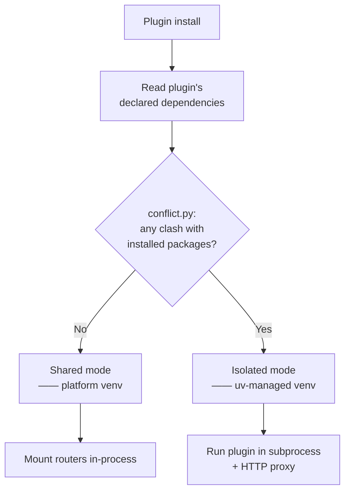
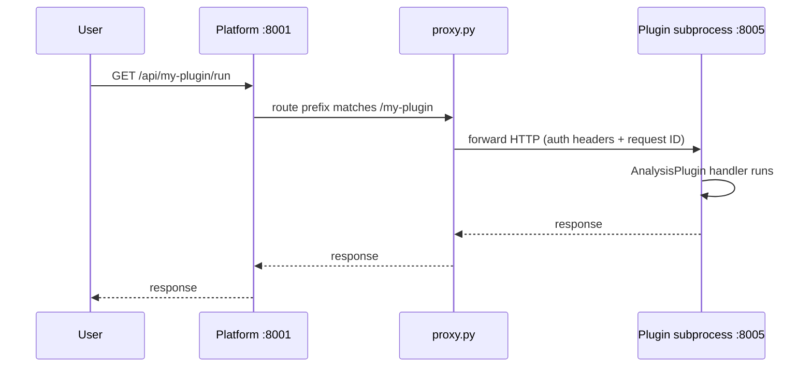

# Isolation

MINT runs plugins with as little process overhead as possible while still tolerating dependency conflicts and crashes. Two strategies cover the spectrum: shared environment and per-plugin venv.

## When each kicks in



The conflict check compares each declared requirement against the platform's resolved environment using PEP 440 specifier intersection. If every plugin requirement is satisfiable by a single resolution that also keeps existing plugins working, shared mode is used.

## Shared mode

When a plugin's dependencies don't clash, MINT installs the wheel into the platform's environment and mounts the plugin's routers directly inside the FastAPI app. There's no extra process, no extra port, no proxy hop.

| | Shared mode |
|---|---|
| Startup cost | None — plugin code is imported in-process |
| Per-request cost | Zero — direct function call |
| Crash blast radius | Wrapped by `api/plugins/middleware.py` — a route exception becomes a 500 for that route only |
| Visible to user | Identical to native platform routes |

This is the default and the right choice for the vast majority of plugins. Only reach for isolation when you genuinely have conflicting deps.

## Isolated mode

When `conflict.py` detects an unresolvable clash (most often: two plugins want different majors of the same library), MINT provisions a per-plugin venv via `uv` and runs the plugin in its own subprocess on a dedicated port.



| | Isolated mode |
|---|---|
| Startup cost | One subprocess + one venv per isolated plugin |
| Per-request cost | One extra HTTP hop (loopback) |
| Crash blast radius | Subprocess crash; `subprocess_manager.py` restarts it |
| Visible to user | Identical URL — the proxy is transparent |

The proxy forwards:
- Request method, path, query string, body
- Auth headers (the platform's JWT cookie / bearer token)
- The `X-Request-Id` for log correlation
- The plugin internal-token (issued by the platform, scoped per plugin) so the plugin can call back to the platform's internal API for things like reading experiments

## Communication back to the platform

An isolated plugin doesn't share memory with the platform — it talks back over HTTP using the platform's `/api/internal` surface, authenticated by the per-plugin internal token. `PlatformContext` hides this from plugin code: when integrated and isolated, the context's `get_experiment_repository()` returns a wrapper that issues HTTP calls; when integrated and shared, the wrapper points at the in-process repository.

Plugin code is identical in both modes.

## Dev mode proxy

In development, plugins are typically run as standalone subprocesses with `mint dev --platform` so the developer can hot-reload either side independently. `api/plugins/dev_proxy.py` consumes a `config.dev.toml` that maps route prefixes to localhost URLs:

```toml
# mld/config.dev.toml
[proxy]
"/lcms-sequence" = "http://localhost:8004"
"/peak-picking"  = "http://localhost:8005"
```

The dev proxy uses the same forwarding logic as the production isolation proxy — same auth headers, same request IDs, same internal token — so a plugin that works under `mint dev --platform` will work in production isolated mode.

## Trade-offs and guidance

| Concern | Shared | Isolated |
|---------|--------|----------|
| Startup time | Fastest | Adds 200–500 ms per plugin (venv creation amortized after first run) |
| Cold-call latency | ~0 ms | ~1–3 ms localhost overhead |
| Memory | Shared with platform | Each subprocess has its own Python runtime (~30–80 MB base) |
| Debugger attach | Attach once to platform | Attach to platform AND plugin process |
| Logs | Single stream | Per-process; `subprocess_manager.py` aggregates with a prefix |

**Default to shared.** Reach for isolation when:

- A plugin pins to a major version of a library the platform also uses
- A plugin links a native binary that's incompatible with another plugin's
- A plugin is unstable enough that you want crashes contained as separate processes (rare — middleware already covers route-level errors)

## Configuration

Isolation is decided automatically. To force a plugin into isolated mode (e.g., to test the proxy path), set:

```json
{
  "plugins": {
    "forceIsolated": ["my-plugin-slug"]
  }
}
```

Conversely, to force shared mode and skip the conflict check (rarely a good idea):

```json
{
  "plugins": {
    "forceShared": ["my-plugin-slug"]
  }
}
```

## Next

→ [PlatformContext](/sdk/concepts/platform-context) — how plugins reach platform services from either mode
→ [Operations → Deploying](/sdk/operations/deploying) — production considerations when isolation kicks in
