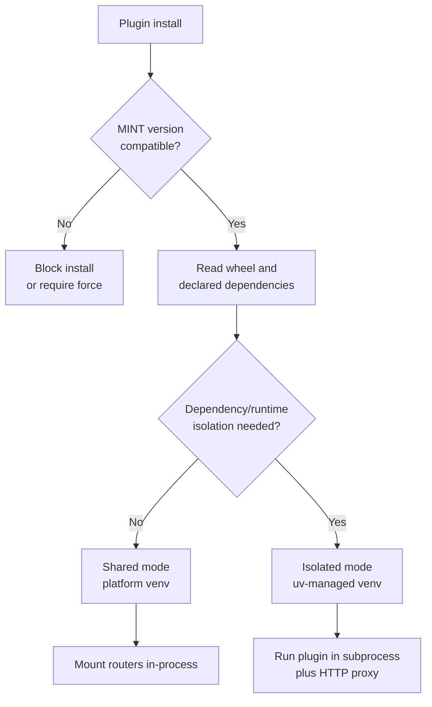
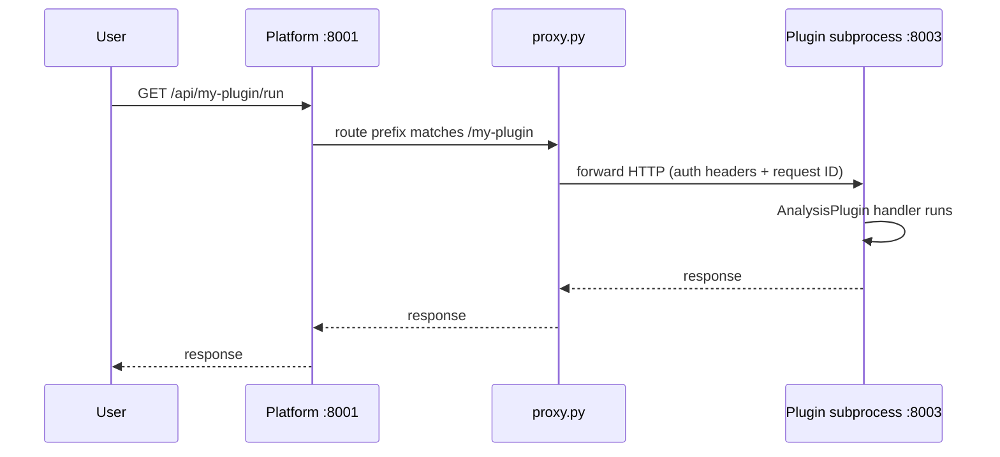

# Isolation

MINT runs plugins with as little process overhead as possible while still
tolerating incompatible Python dependencies and plugin crashes. Version
compatibility is checked first; runtime isolation is only considered after a
plugin is allowed to install on the current platform.

## When each kicks in


```mermaid
flowchart TD
    A[Plugin install] --> B{MINT version<br/>compatible?}
    B -->|No| X[Block install<br/>or require force]
    B -->|Yes| C[Read wheel and<br/>declared dependencies]
    C --> D{Dependency/runtime<br/>isolation needed?}
    D -->|No| E[Shared mode<br/>platform venv]
    D -->|Yes| F[Isolated mode<br/>uv-managed venv]
    E --> G[Mount routers in-process]
    F --> H[Run plugin in subprocess<br/>plus HTTP proxy]
```

The version gate checks two sources:

| Source | Checked against |
|--------|-----------------|
| Marketplace `min_platform_version` | The running MINT platform version |
| Bundle `[tool.mint].requires_mint` / manifest `requires_mint` | The running MINT platform version |

The platform and `mint-sdk` are version-locked. Shared installs use a
constraints file so a plugin cannot silently upgrade or downgrade the platform
SDK. Isolated installs also pin the plugin venv to the platform's exact
`mint-sdk` version; if the plugin wheel declares a range that excludes that
version, the install fails before the resolver produces a confusing error.

After version compatibility passes, the dependency/runtime decision determines
whether the plugin can run in-process or must use a subprocess runtime.

## Shared mode

When a plugin's dependencies don't clash, MINT installs the wheel into the platform's environment and mounts the plugin's routers directly inside the FastAPI app. There's no extra process, no extra port, no proxy hop.

| | Shared mode |
|---|---|
| Startup cost | None — plugin code is imported in-process |
| Per-request cost | Zero — direct function call |
| Crash blast radius | Wrapped by `api/plugins/middleware.py` — a route exception becomes a 500 for that route only |
| Visible to user | Identical to native platform routes |

This is the default and the right choice for the vast majority of plugins. Keep
your `mint-sdk` dependency range honest and avoid pinning common libraries too
tightly unless your plugin really needs it.

## Isolated mode

When a plugin is installed as a subprocess runtime, MINT provisions a
per-plugin venv via `uv`, caches the trusted wheel bundle under
`server.dataPath`, records the runtime in the plugin manifest, and runs the
plugin on a dedicated local port.


```mermaid
sequenceDiagram
    participant U as User
    participant P as Platform :8001
    participant M as proxy.py
    participant S as Plugin subprocess :8003

    U->>P: GET /api/my-plugin/run
    P->>M: route prefix matches /my-plugin
    M->>S: forward HTTP (auth headers + request ID)
    S->>S: AnalysisPlugin handler runs
    S-->>M: response
    M-->>P: response
    P-->>U: response
```

| | Isolated mode |
|---|---|
| Startup cost | One subprocess + one venv per isolated plugin |
| Per-request cost | One extra HTTP hop (loopback) |
| Crash blast radius | Subprocess crash; `subprocess_manager.py` restarts it |
| Visible to user | Identical URL — the proxy is transparent |

The proxy forwards:
- Request method, path, query string, body
- Auth headers (the platform's JWT cookie / bearer token)
- The `X-Request-Id` for log correlation
- The plugin internal-token (issued by the platform, scoped per plugin) so the plugin can call back to the platform's internal API for things like reading experiments

## Communication back to the platform

An isolated plugin doesn't share memory with the platform — it talks back over HTTP using the platform's `/api/internal` surface, authenticated by the per-plugin internal token. `PlatformContext` hides this from plugin code: when integrated and isolated, the context's `get_experiment_repository()` returns a wrapper that issues HTTP calls; when integrated and shared, the wrapper points at the in-process repository.

Plugin code is identical in both modes.

Admins can inspect active subprocess runtimes in the server status view's
**Plugin processes** card. It lists plugin name, status, port, start time, and
restart count. If no subprocess plugins are active, the card says that no
plugin subprocesses are isolated on separate ports.

## Dev mode proxy

In development, plugins are typically run as standalone subprocesses with `mint dev --platform` so the developer can hot-reload either side independently. `api/plugins/dev_proxy.py` consumes a `config.dev.toml` that maps route prefixes to localhost URLs:

```toml
# MINT/config.dev.toml
[proxy]
"/hello-mint"    = "http://localhost:8003"
"/peak-picking"  = "http://localhost:8004"
```

The dev proxy preserves the production URL shape and forwards normal request headers, including user identity headers when the request has a bearer token. It does not install the plugin into the platform process and does not set `MINT_PLATFORM_URL` / `MINT_PLUGIN_TOKEN` for the dev server. Code that needs a full `PlatformContext` should still be tested with the plugin installed in a disposable MINT instance or with explicit SDK test harnesses.

## Trade-offs and guidance

| Concern | Shared | Isolated |
|---------|--------|----------|
| Startup time | Fastest | Adds 200–500 ms per plugin (venv creation amortized after first run) |
| Cold-call latency | ~0 ms | ~1–3 ms localhost overhead |
| Memory | Shared with platform | Each subprocess has its own Python runtime (~30–80 MB base) |
| Debugger attach | Attach once to platform | Attach to platform AND plugin process |
| Logs | Single stream | Per-process; `subprocess_manager.py` aggregates with a prefix |

**Default to shared.** Reach for isolation when:

- A plugin pins to a major version of a library the platform also uses
- A plugin links a native binary that's incompatible with another plugin's
- A plugin is unstable enough that you want crashes contained as separate processes (rare — middleware already covers route-level errors)

## Configuration

Plugin loading configuration lives under `plugins` in `config.json`:

| Key | Use |
|-----|-----|
| `loadFromEntryPoints` | Discover installed `mint.plugins` entry points on startup |
| `plugins` | Add explicit module/class plugin entries for local or special deployments |
| `extraIndexUrls` | Additional Python package indexes used during plugin installs |
| `settings` | Durable per-plugin settings resolved for decorator-declared config |

Current user-facing configuration does not expose `forceIsolated` or
`forceShared` switches. To exercise subprocess behavior during development,
test an installed bundle in a disposable MINT instance, or run a standalone
plugin behind the development proxy with `mint dev --platform`.

## Next

→ [PlatformContext](/sdk/concepts/platform-context) — how plugins reach platform services from either mode
→ [Operations → Deploying](/sdk/operations/deploying) — production considerations when isolation kicks in
