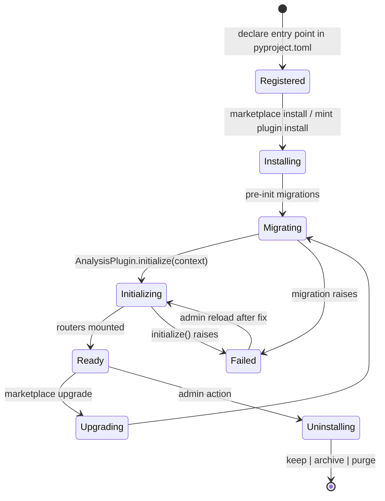

# Plugin lifecycle

A plugin moves through a small fixed set of phases. Knowing them helps you decide where to put which code: schema setup goes in migrations, runtime setup goes in `initialize`, cleanup goes in `shutdown`, status reporting goes in `check_health`.

## State diagram



## Phase by phase

### Registered

Your plugin's wheel is published (PyPI, internal index, or a `.mint` bundle) and declares an entry point in the `mld.plugins` group:

```toml
# pyproject.toml
[project.entry-points."mld.plugins"]
my-plugin = "my_plugin.plugin:MyPlugin"
```

The entry-point name is the **install slug** (URL-safe, hyphenated). The right-hand side is the dotted import path to the `AnalysisPlugin` subclass.

The platform discovers entry points on every startup when `plugins.loadFromEntryPoints` is `true` (default).

### Installing

Triggered by **Admin → Marketplace → Install** or `mint plugin install <wheel-or-pypi-name>`. The platform:

1. Resolves the wheel and downloads it
2. Checks dependency conflicts via `conflict.py`
3. If conflicts, allocates a per-plugin `uv` venv via `isolation.py`; otherwise uses the platform's environment
4. Snapshots pre-install database state via `snapshot.py` so a failed install can roll back

### Migrating

Before `initialize()` runs, `MigrationRunner` applies the plugin's pending migrations:

- Reads `get_migrations_package()` to find the plugin's migration package
- Acquires a Postgres advisory lock to serialize migrations across replicas
- Compares applied revisions in `plugin_schema_migrations` with the on-disk revisions
- Runs each pending migration in order

A failure here puts the plugin in **Failed** state — its routes don't mount, and the admin UI surfaces the error. Fix the migration in a new plugin release; on next startup, the runner picks up where it left off.

See [Migrations](/sdk/concepts/migrations) for the migration framework itself.

### Initializing

The platform calls `await plugin.initialize(context)`:

- `context` is a `PlatformContext` when integrated, or `None` when standalone
- Use this hook to: stash the context, open external clients, populate caches, set up plugin-specific config
- The hook is awaited synchronously; routes don't mount until it returns
- Raise `PluginLifecycleException` (or any exception) to abort initialization

```python
from mint_sdk import PluginLifecycleException

class MyPlugin(AnalysisPlugin):
    async def initialize(self, context=None):
        self._context = context
        if not self._validate_config():
            raise PluginLifecycleException(
                "MyPlugin requires 'thresholds' in plugin settings",
                phase="initialize",
                plugin_name=self.metadata.name,
            )
```

### Ready

`get_routers()` is called and returned routers mount under `routes_prefix`. The plugin tile becomes visible to users with the appropriate plugin role; HTTP requests start arriving.

While ready, the platform may also call:

| Hook | When |
|------|------|
| `check_health()` | Periodically and on demand from **Admin → Status** |
| `on_before_experiment_save(experiment_id, data)` | Before any experiment write |
| `on_after_experiment_save(experiment_id, data)` | After a successful experiment write |
| `on_experiment_status_change(experiment_id, old, new)` | Status flip — e.g., `ongoing → completed` |
| `apply_settings(settings)` | When config changes through the UI |

All hooks have safe no-op defaults — implement only the ones you need.

### Upgrading

A marketplace upgrade is **install + migrate + restart-the-plugin-process**:

1. Install the new wheel
2. Run any new migrations (with the snapshot still pinned)
3. Call `shutdown()` on the running plugin
4. Call `initialize()` on the new plugin instance
5. Drop the snapshot if everything succeeded; restore from it if anything failed

The platform itself doesn't restart — only the plugin's process / mount swaps.

### Uninstalling

The admin chooses one of three modes:

| Mode | Effect on plugin-owned data |
|------|-----------------------------|
| **keep** (default) | Tables and rows remain. Reinstalling the plugin restores access. |
| **archive** | Tables renamed with an `archived_<timestamp>_` prefix. Unreachable but recoverable via raw SQL. |
| **purge** | Tables, rows, and uploaded artifacts dropped. Irreversible. |

The platform calls `shutdown()`, unmounts the routes, applies the data action, and removes the entry from `plugin_schema_migrations`.

## Failed state

A plugin reaches **Failed** when:

- A migration raises during `Migrating`
- `initialize()` raises during `Initializing`
- `check_health()` consistently returns `HealthStatus.UNHEALTHY`

Failed plugins are listed in **Admin → Plugins** with the failure reason. They don't accept HTTP traffic. The admin fixes the root cause and clicks **Reload**, which re-runs `Migrating → Initializing`.

## Hook reference

| Method | Required? | Default |
|--------|-----------|---------|
| `metadata` | yes | abstract |
| `get_routers()` | yes | abstract |
| `initialize(context)` | yes | abstract |
| `shutdown()` | yes | abstract |
| `check_health()` | no | returns `HealthStatus.HEALTHY` |
| `on_before_experiment_save(...)` | no | returns `LifecycleHookResult(success=True)` |
| `on_after_experiment_save(...)` | no | no-op |
| `on_experiment_status_change(...)` | no | no-op |
| `apply_settings(settings)` | no | populates `self.settings` |
| `get_migrations_package()` | no | returns `None` (no migrations) |
| `get_shared_models()` | no | returns `[]` (no tables) |

## Next

→ [Isolation](/sdk/concepts/isolation) — what happens when dependencies conflict
→ [Migrations](/sdk/concepts/migrations) — the migration framework in detail
→ [Recipes → Testing plugins](/sdk/recipes/testing-plugins) — exercising lifecycle hooks under test
