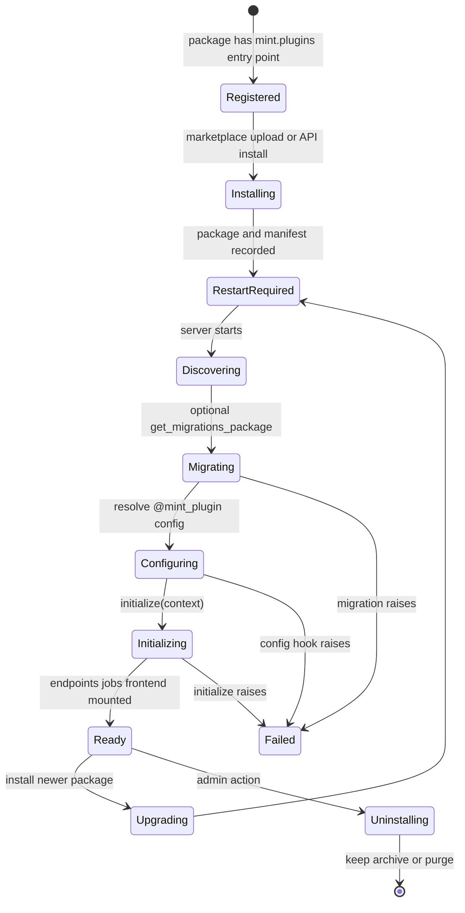

# Plugin lifecycle

A plugin has two lifecycles:

| Lifecycle | Who cares | Key question |
|-----------|-----------|--------------|
| **Install lifecycle** | Lab admins | Is the package installed, compatible, and active after restart? |
| **Runtime lifecycle** | Plugin authors | Which plugin methods or decorators run at startup, request time, and shutdown? |

Knowing the difference helps you put code in the right place. Schema setup goes
in migrations, startup resources go in `initialize()`, typed config side effects
go in `@on_config_change`, status reporting goes in `@health_check`, and route
logic goes in `@endpoint` handlers or native routers.

## State diagram


```mermaid
stateDiagram-v2
    [*] --> Registered: package has mint.plugins entry point
    Registered --> Installing: marketplace upload or API install
    Installing --> RestartRequired: package and manifest recorded
    RestartRequired --> Discovering: server starts
    Discovering --> Migrating: optional get_migrations_package
    Migrating --> Configuring: resolve @mint_plugin config
    Configuring --> Initializing: initialize(context)
    Initializing --> Ready: endpoints jobs frontend mounted
    Ready --> Upgrading: install newer package
    Upgrading --> RestartRequired
    Ready --> Uninstalling: admin action
    Uninstalling --> [*]: keep archive or purge
    Migrating --> Failed: migration raises
    Configuring --> Failed: config hook raises
    Initializing --> Failed: initialize raises
```

## Phase by phase

### Registered

Your plugin's wheel is published (PyPI, internal index, or a `.mint` bundle) and declares an entry point in the `mint.plugins` group:

```toml
# pyproject.toml
[project.entry-points."mint.plugins"]
my-plugin = "my_plugin.plugin:MyPlugin"
```

The entry-point name is the **install slug** (URL-safe, hyphenated). The right-hand side is the dotted import path to the `AnalysisPlugin` subclass.

Put `name`, `version`, `description`, authors, homepage, and license in the
PEP 621 `[project]` table. Use `@mint_plugin(...)` on the class for runtime
behavior:

```python
from mint_sdk import AnalysisPlugin, PluginCapabilities, PluginType, mint_plugin

@mint_plugin(
    analysis_type="lcms",
    routes_prefix="/peak-qc",
    plugin_type=PluginType.ANALYSIS,
    capabilities=PluginCapabilities(
        requires_auth=True,
        requires_experiments=True,
    ),
)
class PeakQcPlugin(AnalysisPlugin):
    ...
```

The platform discovers entry points on every startup when `plugins.loadFromEntryPoints` is `true` (default).

### Installing

Triggered by **Admin -> Plugins -> Registry -> Install**, bundle upload,
or an admin install request through the platform API. The platform:

1. Resolves the registry entry, upload, wheel, or `.mint` bundle.
2. Checks marketplace `min_platform_version` and bundle `[tool.mint].requires_mint`.
3. Pins plugin installs to the platform's own `mint-sdk` version.
4. Checks dependency conflicts before changing the environment.
5. Installs the wheel or bundle and records the source artifact in the plugin manifest.
6. Keeps a best-effort Python environment snapshot for rollback.

Most successful installs report that a server restart is required. Until that
restart/load cycle completes, the package may be installed but not serving
traffic.

### Migrating

Before `initialize()` runs, `MigrationRunner` applies the plugin's pending migrations:

- Reads `get_migrations_package()` to find the plugin's migration package, if any
- Acquires a Postgres advisory lock to serialize migrations across replicas
- Compares applied revisions in `plugin_schema_migrations` with the on-disk revisions
- Runs each pending migration in order

A failure here puts the plugin in **Failed** state — its routes don't mount, and the admin UI surfaces the error. Fix the failure in a new plugin release. The pending migration batch runs in one transaction; a failure rolls back that batch, which is retried on the next startup. Previously committed revisions remain applied.

See [Migrations](/sdk/concepts/migrations) for the migration framework itself.

### Configuring

If the class uses `@mint_plugin(config=SettingsModel)`, MINT loads the durable
plugin settings, validates them with the Pydantic model, and then runs matching
`@on_config_change` handlers before `initialize()`.

```python
from pydantic import BaseModel, Field
from mint_sdk import AnalysisPlugin, ConfigChange, mint_plugin, on_config_change

class PeakQcSettings(BaseModel):
    min_signal: float = Field(1000, ge=0)

@mint_plugin(analysis_type="lcms", routes_prefix="/peak-qc", config=PeakQcSettings)
class PeakQcPlugin(AnalysisPlugin):
    @on_config_change()
    def apply_config(self, change: ConfigChange[PeakQcSettings]) -> None:
        self._min_signal = change.current.min_signal
```

Startup settings hook failures stop plugin initialization. Keep config side
effects here; do not create a second plugin-owned config file for integrated
mode.

### Initializing

The platform calls `await plugin.initialize(context)`:

- `context` is a `PlatformContext` when integrated, or `None` when standalone
- Use this hook to: stash the context, open external clients, populate caches, use already validated typed settings
- The hook is awaited synchronously; routes don't mount until it returns
- Raise `PluginLifecycleException` (or any exception) to abort initialization
- You only override it when the plugin owns startup resources. The SDK default stores the context.

```python
from mint_sdk import PluginLifecycleException

class MyPlugin(AnalysisPlugin):
    async def initialize(self, context=None):
        await super().initialize(context)
        if not self._validate_config():
            raise PluginLifecycleException(
                "MyPlugin requires 'thresholds' in plugin settings",
                phase="initialize",
                plugin_name=self.metadata.name,
            )
```

### Ready

The SDK resolves all plugin surfaces and MINT mounts them under
`routes_prefix`:

| Surface | How authors declare it |
|---------|------------------------|
| HTTP endpoints | `@endpoint.get/post/...` or native `get_routers()` |
| Experiment-scoped route groups | `@endpoint.group(..., scope="experiment")` |
| Jobs | `@job` methods, mounted under the SDK-owned jobs runtime |
| Generated UI | `@generated_ui` plus generated job/result metadata |
| Frontend assets | `get_frontend_dir()` / packaged frontend build |
| Native routers | `PluginRouterMount` from `get_routers()` for escape hatches |

The plugin tile becomes visible to users who can see the plugin and whose
plugin role permits access. HTTP requests start arriving after this point.

While ready, the platform or SDK runtime may also call:

| Hook | When |
|------|------|
| `@health_check` / `check_health()` | Periodically and on demand from admin status |
| `@on_event("experiment.before_save")` | Before platform design-data save; may veto the write |
| `@on_event("experiment.after_save")` | After platform design-data save |
| `@on_event("experiment.status_changed")` | Status flip such as `ongoing -> completed` |
| `@on_config_change` | When platform plugin settings are saved/reset or applied at startup |
| `@notify` | When plugin code returns a typed notification event |
| `@calendar_event` | When plugin code returns or cancels a typed calendar event |

The legacy methods `on_before_experiment_save()`,
`on_after_experiment_save()`, and `on_experiment_status_change()` still work as
migration paths. Prefer the decorators for new code, and never combine a
legacy method and a decorator for the same event.

### Upgrading

A marketplace upgrade is a package install followed by a load cycle:

1. Install the new wheel
2. Record the new manifest/registry metadata
3. Report restart-required state when the new code is not active yet
4. On restart, discover the new entry point metadata
5. Run any new migrations
6. Resolve config, run startup hooks, call `initialize()`, and mount surfaces

Do not assume a marketplace update hot-swaps the running plugin. In the current
platform, installed packages can appear as **Installed but not loaded yet** or
**Pending restart** until the server reloads.

### Uninstalling

The admin chooses one of three modes:

| Mode | Effect on plugin-owned data |
|------|-----------------------------|
| **keep** (default) | Tables and rows remain. Reinstalling the plugin restores access. |
| **archive** | Plugin schema is renamed to an archived schema; recovery requires administrator database work. |
| **purge** | Tables, rows, and uploaded artifacts dropped. Irreversible. |

The browser UI and normal CLI path use the safe default: remove the package and
keep plugin-owned data. The plugin manager also tracks unfinished cleanup for
manifest, notification, and calendar data so interrupted uninstalls can be
finalized later.

## Shutdown and resource cleanup

When the host stops or unloads the plugin, close plugin-owned clients and tasks in `shutdown()`. Call the base `initialize()` when overriding it so persistence and context helpers retain their normal behavior.

```python
import httpx
from mint_sdk import AnalysisPlugin, PlatformContext

class MyPlugin(AnalysisPlugin):
    async def initialize(self, context: PlatformContext | None = None) -> None:
        await super().initialize(context)
        self._http = httpx.AsyncClient(timeout=20.0)

    async def shutdown(self) -> None:
        await self._http.aclose()
```

## Typed events and their limits

Use decorators for new handlers. A before-save validator should scope itself to its own design payload, because the platform broadcasts experiment events:

```python
from mint_sdk import BeforeExperimentSave, LifecycleHookResult, on_event

@on_event("experiment.before_save")
async def validate_design(self, event: BeforeExperimentSave) -> LifecycleHookResult:
    if event.data.get("plugin_id") != self.metadata.name:
        return LifecycleHookResult(success=True)
    payload = event.data.get("data", {})
    if not payload.get("samples"):
        return LifecycleHookResult(success=False, message="Add at least one sample")
    return LifecycleHookResult(success=True)
```

For platform design saves, `event.data` contains `{ "plugin_id": ..., "data": ... }`; it is not the inner design payload directly. Typed events also provide `experiment_id` and optional `experiment`, `request_id`, and `actor` information. Do not assume optional context is present for every host or legacy path.

`experiment.before_save` is blocking. SDK decorator dispatch converts vetoes and handler failures into a rejected operation. After-save/status handlers are isolated observers; their failures do not roll back the completed operation. Legacy overridden methods remain migration paths and have different error-isolation behavior, so do not rely on an exception in a legacy before-save method as a validator.

These are platform-service events, not database triggers. Direct scoped repository writes and `self.save_design()` do not automatically traverse every platform service hook. Enforce invariants that must apply to every design write with `design_schema`; perform operation-specific validation before calling a repository. Keep hooks fast and avoid saving the same design recursively from its own event handler.

For plugin-local events, use a namespaced name with `await self.emit_event("my-plugin.refreshed", payload)` and a matching `@on_event` observer. This is not a durable job queue or a cross-plugin message bus.

## Settings revisions and runtime changes

`@on_config_change()` receives a `ConfigChange[Settings]` with the current typed settings, previous settings when available, source, and explicitly supplied fields. Startup hooks run before `initialize()`; later saves run the same side effects. Avoid hooks that require a client not yet opened by `initialize()`.

```python
candidate = self.settings.model_copy(update={"min_signal": 1500})
await self.save_settings_transactionally(
    candidate, expected_revision=self.settings_revision,
)

# For a shallow partial update, read/retry against the latest durable snapshot:
await self.patch_settings_transactionally({"min_signal": 1500})
```

Revisions are opaque content ETag/CAS tokens, not increasing migration numbers. A stale full replacement conflicts; it does not merge or retry automatically. A patch is shallow, so a supplied nested object replaces that field rather than deep-merging it. Settings revisions, package versions, SQL migration integers, and design payload schema versions solve different problems.

## Failed state

A plugin reaches **Failed** when:

- A migration raises during `Migrating`
- `initialize()` raises during `Initializing`
- Typed startup configuration or its change hook fails

Failed plugins are surfaced in admin status with the failure reason. They do
not accept plugin HTTP traffic. Ship a fixed plugin release or fix the
configuration, then restart/reload the server so startup can retry.

## Hook reference

| Surface | Required? | Default / current guidance |
|---------|-----------|----------------------------|
| `mint.plugins` entry point | yes | One entry pointing to the `AnalysisPlugin` subclass |
| Runtime metadata | yes | Prefer `@mint_plugin(...)`; legacy `metadata` property remains supported |
| `@endpoint` handlers | no | Use for ordinary HTTP routes |
| `get_routers()` | no | Defaults to `[]`; keep for native FastAPI escape hatches |
| `initialize(context)` | no | Stores context by default; override for owned resources |
| `shutdown()` | no | No-op by default |
| `@health_check` / `check_health()` | no | Healthy default |
| `@on_event(...)` | no | Use for experiment or plugin-local events |
| `@on_config_change(...)` | no | Requires a `@mint_plugin(config=...)` model |
| `get_migrations_package()` | no | Returns `None` (no migrations) |
| `get_shared_models()` | no | Returns `[]` (no tables) |

Health is a runtime diagnostic; an unhealthy report alone should not be described as an automatic route unload. Inspect the admin error and logs for the actual startup/runtime failure.

Verified against [v1.2.0 plugin lifecycle](https://github.com/MorscherLab/MINT/blob/v1.2.0/packages/sdk-python/src/mint_sdk/plugin.py), [settings](https://github.com/MorscherLab/MINT/blob/v1.2.0/packages/sdk-python/src/mint_sdk/plugin_settings.py), and [platform design-save service](https://github.com/MorscherLab/MINT/blob/v1.2.0/api/services/experiment_service.py).

## Next

→ [Isolation](/sdk/concepts/isolation) — what happens when dependencies conflict
→ [Migrations](/sdk/concepts/migrations) — the migration framework in detail
→ [Recipes → Testing plugins](/sdk/recipes/testing-plugins) — exercising lifecycle hooks under test
