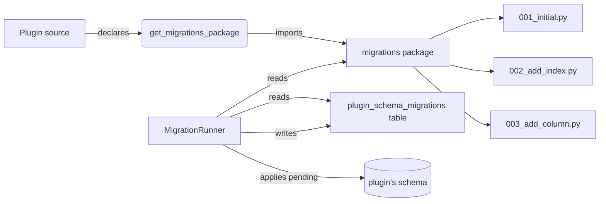

# Migrations

Plugins that own database tables evolve their schema through `mint_sdk.migrations`. Each plugin maintains its own migration history, independent of the platform's. The platform's `MigrationRunner` applies pending migrations on startup, advisory-locked so two replicas can't race.

## When to use migrations

Use migrations when:

- Your plugin declares tables it queries with SQL (not JSON columns inside `DesignData`)
- You want indexes, foreign keys, or unique constraints
- You want production deployments to upgrade safely without manual SQL
- You want CI to verify schema changes apply cleanly to a fresh install AND to an upgrade from any prior version

Skip migrations when:

- All your plugin's data fits inside `DesignData.data` JSON or `PluginAnalysisResult.result` JSON
- You only need ephemeral state (caches, queues) that can be regenerated

For the simpler "just create the tables" case where you don't need version history, override `get_shared_models()` instead — the platform calls `create_all()` on startup. Migrations and `get_shared_models()` are mutually exclusive: use one or the other, not both.

## Architecture



`plugin_schema_migrations` is a platform-owned table (added in platform migration v011). It records `(plugin_id, revision, applied_at, checksum)`. The runner compares it with the on-disk migrations package and runs anything missing in lexicographic order.

## Declaring migrations

Three pieces:

1. A migrations package inside your plugin
2. One module per revision, each containing a `Migration` class
3. The plugin overrides `get_migrations_package()` to point at the package

```
my_plugin/
├── __init__.py
├── plugin.py
└── migrations/
    ├── __init__.py
    ├── 001_initial.py
    ├── 002_add_lot_index.py
    └── 003_add_concentration_column.py
```

```python
# my_plugin/plugin.py
from mint_sdk import AnalysisPlugin, PluginMetadata

class MyPlugin(AnalysisPlugin):
    @property
    def metadata(self) -> PluginMetadata: ...

    def get_routers(self): ...
    async def initialize(self, context=None): self._context = context
    async def shutdown(self): pass

    def get_migrations_package(self) -> str:
        return "my_plugin.migrations"
```

```python
# my_plugin/migrations/001_initial.py
from mint_sdk.migrations import PluginMigration, MigrationOps


class Migration(PluginMigration):
    revision = "001"
    description = "create panels table"

    async def upgrade(self, ops: MigrationOps) -> None:
        await ops.create_table(
            "panels",
            [
                ops.column("id", "uuid", primary_key=True),
                ops.column("experiment_id", "integer", nullable=False),
                ops.column("name", "text", nullable=False),
                ops.column("design_json", "jsonb", nullable=False),
                ops.column("created_at", "timestamp", nullable=False),
            ],
        )
        await ops.create_index("idx_panels_experiment", "panels", ["experiment_id"])
```

The class **must** be named `Migration` (the runner discovers by class name, not file name). The `revision` is whatever short string makes sense — most plugins use zero-padded numbers (`001`, `002`, …) so file ordering matches revision ordering.

## `MigrationOps`

`MigrationOps` is the portable DDL surface. It emits the right SQL for the active backend (Postgres in production, SQLite for standalone tests).

| Method | Purpose |
|--------|---------|
| `column(name, type, *, primary_key=False, nullable=True, default=None, unique=False)` | Build a column definition for `create_table` |
| `create_table(name, columns)` | Create a new table |
| `drop_table(name)` | Drop a table |
| `add_column(table, column_def)` | Add a column to an existing table |
| `drop_column(table, column_name)` | Drop a column |
| `rename_column(table, old, new)` | Rename a column |
| `create_index(name, table, columns, *, unique=False)` | Create an index |
| `drop_index(name)` | Drop an index |
| `execute(sql, params=None)` | Run raw SQL when the abstraction isn't enough |

Portable types: `integer`, `bigint`, `text`, `varchar`, `boolean`, `float`, `numeric`, `timestamp`, `date`, `jsonb` (mapped to TEXT on SQLite), `uuid` (mapped to TEXT on SQLite).

For non-portable backend-specific work (e.g., a Postgres-only `tsvector` column for full-text search), use `ops.execute()` and gate on the backend:

```python
from mint_sdk.migrations import PluginMigration, MigrationOps

class Migration(PluginMigration):
    revision = "004"
    description = "add full-text index (postgres only)"

    async def upgrade(self, ops: MigrationOps) -> None:
        if ops.backend == "postgresql":
            await ops.execute(
                "ALTER TABLE panels ADD COLUMN search_vec tsvector "
                "GENERATED ALWAYS AS (to_tsvector('english', name)) STORED"
            )
            await ops.execute(
                "CREATE INDEX idx_panels_search_vec ON panels USING GIN (search_vec)"
            )
        # SQLite plugins can fall through with an alternative or a comment
```

## Running migrations

You don't run migrations manually in production — the platform calls `MigrationRunner` on every startup before `initialize()`:

1. Acquires Postgres advisory lock keyed by `plugin_id`
2. Lists revisions on disk
3. Lists revisions already applied in `plugin_schema_migrations`
4. Runs each missing revision in order, inside a transaction
5. Commits the `plugin_schema_migrations` row only after the migration's transaction commits
6. Releases the advisory lock

For local development:

```bash
# Inside a plugin project, the platform runs the runner on startup
mint dev --platform
```

For a standalone platform start (no plugin attached), the migration runner runs as part of the normal `uvicorn` startup — there is no "migrate only" mode.

For tests:

```python
# Recipe: see /sdk/recipes/testing-plugins
from mint_sdk.testing import in_memory_runner

async def test_v002_adds_index(plugin):
    runner = in_memory_runner(plugin)
    await runner.upgrade_to("002")
    # assert against the resulting schema
```

## Append-only discipline

Once a migration has been applied to a deployment, **never edit the file**. The runner stores a checksum; an edited migration triggers `MigrationChecksumError` on the next startup, blocking the plugin until the change is reverted.

To change schema after a migration is shipped, write a new migration that performs the change. Backwards-incompatible changes (drop a column other plugins might depend on) deserve a major version bump.

## Failure handling

A migration that raises rolls back the transaction and the plugin enters **Failed** state. The admin UI surfaces:

- `schema_version` — last successfully applied revision
- `pending_migrations` — revisions known to the plugin but not applied
- `migration_error` — the exception message

Common failure causes:

| Error | Likely cause |
|-------|--------------|
| `MigrationChecksumError` | A previously-applied migration file was edited |
| `SchemaVersionAheadError` | The DB has a revision the plugin doesn't ship — usually a downgrade attempt |
| `DestructiveMigrationError` | The migration tried `drop_table` / `drop_column` without `--allow-destructive` |
| Generic SQL error | The migration body raised — inspect the message and fix in a follow-up revision |

## Idempotency for backfill data migrations

Migrations sometimes need to backfill data alongside schema changes. Make them idempotent so re-running on a partial application is safe:

```python
class Migration(PluginMigration):
    revision = "005"
    description = "backfill normalized_name"

    async def upgrade(self, ops: MigrationOps) -> None:
        await ops.add_column("panels",
            ops.column("normalized_name", "text", nullable=True)
        )
        await ops.execute(
            "UPDATE panels SET normalized_name = LOWER(name) "
            "WHERE normalized_name IS NULL"
        )
```

For larger backfills, do them in chunks via a recipe — see [Recipes → Backfill migrations](/sdk/recipes/backfill-migration).

## Next

→ [Tutorials → Design plugin with tables](/sdk/tutorials/design-plugin-with-tables) — see migrations end-to-end
→ [Recipes → Backfill migrations](/sdk/recipes/backfill-migration) — patterns for chunked backfills
→ [API Reference → Migrations](/sdk/api/migrations) — exact symbol signatures
