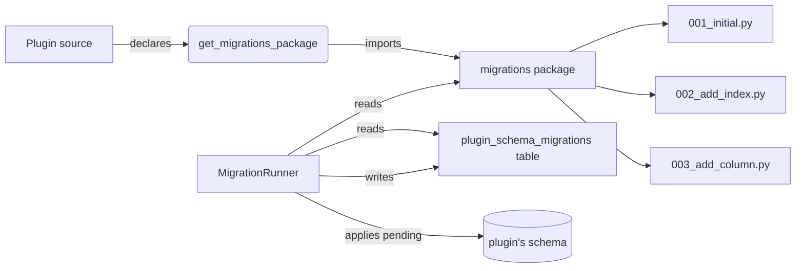

# Migrations

Plugins that own database tables evolve their schema through `mint_sdk.migrations`. Each plugin maintains its own migration history, independent of the platform's. The platform's `MigrationRunner` applies pending migrations on startup, advisory-locked so two replicas can't race.

## When to use migrations

Use migrations when:

- Your plugin declares tables it queries with SQL (not JSON columns inside `DesignData`)
- You want indexes, foreign keys, or unique constraints
- You want production deployments to upgrade safely without manual SQL
- You want CI to verify schema changes apply cleanly to a fresh install AND to an upgrade from any prior version

Skip migrations when:

- All your plugin's data fits inside `DesignData.data` JSON or `PluginAnalysisResult.result` JSON
- You only need ephemeral state (caches, queues) that can be regenerated

For the simpler "just create the tables" case where you don't need version history, override `get_shared_models()` instead — the platform calls `create_all()` on startup. Migrations and `get_shared_models()` are mutually exclusive: use one or the other, not both.

## Architecture



`plugin_schema_migrations` (Postgres) / `_plugin_migrations` (SQLite) is a platform-managed tracking table. Each row records `(plugin_name, version, name, applied_at, checksum, success, error_message)`. The runner compares it against the on-disk migrations package and runs anything missing, ordered by `version`.

## Declaring migrations

Three pieces:

1. A migrations package inside your plugin
2. One module per migration, each containing one or more `PluginMigration` subclasses
3. The plugin overrides `get_migrations_package()` to point at the package

```
my_plugin/
├── __init__.py
├── plugin.py
└── migrations/
    ├── __init__.py
    ├── 001_initial.py
    ├── 002_add_lot_index.py
    └── 003_add_concentration_column.py
```

```python
# my_plugin/plugin.py
from mint_sdk import AnalysisPlugin, PluginMetadata

class MyPlugin(AnalysisPlugin):
    @property
    def metadata(self) -> PluginMetadata: ...

    def get_routers(self): ...
    async def initialize(self, context=None): self._context = context
    async def shutdown(self): pass

    def get_migrations_package(self) -> str:
        return "my_plugin.migrations"
```

```python
# my_plugin/migrations/001_initial.py
import sqlalchemy as sa
from mint_sdk.migrations import PluginMigration, MigrationOps


class CreatePanelsTable(PluginMigration):
    version = 1
    name = "create_panels_table"

    async def upgrade(self, op: MigrationOps) -> None:
        await op.create_table(
            "panels",
            sa.Column("id", sa.Integer, primary_key=True),
            sa.Column("experiment_id", sa.Integer, nullable=False),
            sa.Column("name", sa.String(200), nullable=False),
            sa.Column("drugs", sa.JSON, nullable=False),
        )
        await op.create_index("idx_panels_experiment", "panels", ["experiment_id"])
```

`PluginMigration` requires two class attributes: `version: int` (used for ordering and tracking) and `name: str` (a short snake_case label that appears in logs and the tracking table). The class name itself is arbitrary; the runner discovers any subclass with an integer `version`.

Use the file-naming convention `NNN_<short_name>.py` so module ordering matches version ordering, but only `version` is authoritative.

## `MigrationOps`

`MigrationOps` is the portable DDL surface. It emits idempotent SQL for the active backend (Postgres in production, SQLite for standalone tests).

| Method | Purpose |
|--------|---------|
| `add_column(table, column)` | Add a column. `column` is a `sa.Column` instance. |
| `drop_column(table, column)` | Drop a column. Requires the migration's `destructive=True`. |
| `rename_column(table, old, new)` | Rename a column. |
| `alter_column(table, column_name, ...)` | Alter type / constraints (read source for full signature). |
| `create_table(name, *columns)` | Create a table. `columns` are positional `sa.Column` args. |
| `drop_table(name)` | Drop a table. Requires `destructive=True`. |
| `create_index(name, table, columns, *, unique=False)` | Create an index. |
| `drop_index(name)` | Drop an index. |
| `backfill(table, column, default)` | Set `column` to `default` where currently NULL. |
| `execute(stmt)` | Run a raw SQLAlchemy statement. |

Columns are constructed with `sa.Column(...)` directly — there is no `MigrationOps.column()` factory. Use SQLAlchemy types: `sa.Integer`, `sa.String(N)`, `sa.JSON`, `sa.DateTime`, `sa.Boolean`, etc.

Postgres-specific types come from `sqlalchemy.dialects.postgresql` (e.g., `JSONB`, `UUID`, `TSVECTOR`); they map to TEXT / JSON on SQLite.

For non-portable work, gate on `op._dialect`:

```python
import sqlalchemy as sa
from sqlalchemy import text
from mint_sdk.migrations import PluginMigration, MigrationOps


class AddPanelSearchVector(PluginMigration):
    version = 4
    name = "add_panel_search_vector"

    async def upgrade(self, op: MigrationOps) -> None:
        if op._dialect == "postgresql":
            await op.execute(text(
                "ALTER TABLE panels ADD COLUMN search_vec tsvector "
                "GENERATED ALWAYS AS (to_tsvector('english', name)) STORED"
            ))
            await op.create_index("idx_panels_search_vec", "panels", ["search_vec"])
```

## Destructive operations

`drop_table`, `drop_column`, and other destructive ops require the migration to opt in:

```python
class DropLegacyColumn(PluginMigration):
    version = 7
    name = "drop_legacy_column"
    destructive = True   # required for drop_column / drop_table

    async def upgrade(self, op: MigrationOps) -> None:
        await op.drop_column("panels", "legacy_field")
```

Without `destructive = True`, calling a drop op raises `DestructiveMigrationError`.

## Running migrations

You don't run migrations manually in production — the platform calls `MigrationRunner.run(...)` on every startup before `initialize()`:

1. Acquires a Postgres advisory lock (or SQLite equivalent) keyed by `plugin_name`
2. Ensures the tracking table exists
3. Sorts the discovered migrations by `version`
4. Validates checksums against any already-applied migrations
5. Runs each pending migration's `upgrade(ops)` inside the same transaction as a tracking-table insert

For local development:

```bash
# Inside a plugin project, the platform runs the runner on startup
mint dev --platform
```

For a standalone platform start (no plugin attached), the migration runner runs as part of the normal `uvicorn api.main:app` startup — there is no "migrate only" mode.

## Append-only discipline

Once a migration has been applied to a deployment, **never edit the file**. The runner stores a SHA-256 checksum of the migration class's source code; an edit triggers `MigrationChecksumError` on the next startup, blocking the plugin until the original source is restored.

To change schema after a migration is shipped, write a new migration. Backwards-incompatible schema changes (drop a column other code might depend on) deserve a major version bump on the plugin.

## Failure handling

A migration that raises rolls back the transaction and the runner records the failure in the tracking table (`success=False`, `error_message`). The plugin enters a failed state visible to admins via the platform's status endpoints. The `MigrationResult` returned by `run()` exposes `current_version`, `applied`, `stamped`, and `errors`.

Common failure causes:

| Error | Likely cause |
|-------|--------------|
| `MigrationChecksumError` | A previously-applied migration file was edited |
| `SchemaVersionAheadError` | The DB has a version the plugin doesn't ship — usually a downgrade attempt |
| `DestructiveMigrationError` | The migration called `drop_table`/`drop_column` without setting `destructive = True` |
| Generic SQL error | The migration body raised — inspect the message and fix in a follow-up migration |

## Idempotency for backfill data migrations

Migrations sometimes need to backfill data alongside schema changes. Use `op.backfill()` for the simple "default a NULL column" case; for complex updates, use `op.execute()` with idempotent SQL:

```python
import sqlalchemy as sa
from sqlalchemy import text
from mint_sdk.migrations import PluginMigration, MigrationOps


class BackfillNormalizedName(PluginMigration):
    version = 5
    name = "backfill_normalized_name"

    async def upgrade(self, op: MigrationOps) -> None:
        await op.add_column(
            "panels",
            sa.Column("normalized_name", sa.String(200), nullable=True),
        )
        await op.execute(text(
            "UPDATE panels SET normalized_name = LOWER(name) "
            "WHERE normalized_name IS NULL"
        ))
```

For larger backfills, chunk them — see [Recipes → Backfill migrations](/sdk/recipes/backfill-migration).

## Next

→ [Tutorials → Design plugin with tables](/sdk/tutorials/design-plugin-with-tables) — see migrations end-to-end
→ [Recipes → Backfill migrations](/sdk/recipes/backfill-migration) — patterns for chunked backfills
→ [API Reference → Migrations](/sdk/api/migrations) — exact symbol signatures
