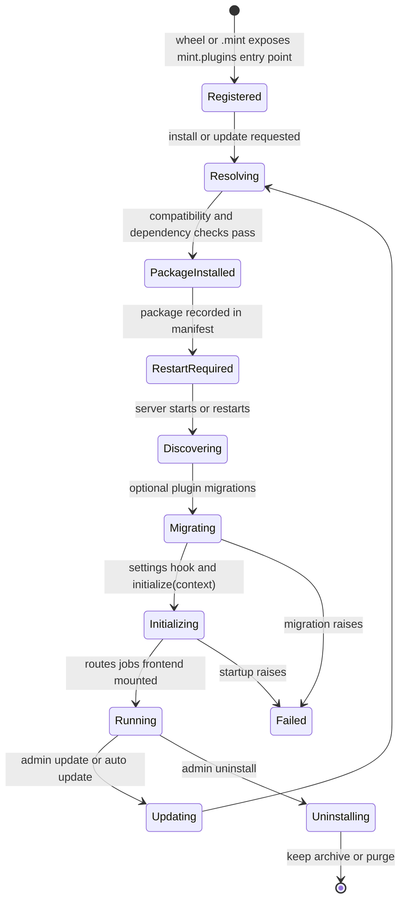

# Plugins

MINT is built around a plugin architecture. The platform itself stays small:
projects, experiments, members, plugins, and marketplace. Everything
lab-specific - LC-MS sequence design, drug-response prediction, chemical
drawing, importers, viewers - arrives as a plugin.

> [Screenshot: Admin -> Plugins page showing Install Plugin, Installed plugins, pending restart rows, and the Browse Registry button]

Think of the plugin system as five layers:

| Layer | What it owns |
|-------|--------------|
| **Package** | A Python wheel or `.mint` bundle with one `mint.plugins` entry point |
| **Runtime metadata** | The `@mint_plugin(...)` declaration: type, route prefix, capabilities, nav items, config schema |
| **Install record** | The platform manifest and registry metadata stored under `server.dataPath` |
| **Runtime load** | Startup discovery, migrations, settings resolution, `initialize(context)`, route/job/frontend mounting |
| **Access and services** | Plugin roles, settings, jobs, notifications, calendar feeds, and uninstall cleanup |

## Four plugin types

Plugin type controls what the plugin may write through `PlatformContext`; all plugin types can still have their own routes and, when they declare migrations, their own plugin-owned tables.

| Type | Typical role | Platform writes |
|------|--------------|-----------------|
| `STATIC` | Read-only reference UI, calculators, viewers | None |
| `ANALYSIS` | Reads experiments and writes analysis outputs | Analysis artifacts and compatibility results |
| `EXPERIMENT_DESIGN` | Creates or edits experiment design data | Experiment design data |
| `FULL` | Combines design and analysis in one plugin | Design data, analysis artifacts, and compatibility results |

Authors often split a related lab capability into two plugins: a design plugin for experiment metadata and workflow, and one or more analysis plugins that read those experiments and produce results. Use `FULL` only when one plugin genuinely owns both sides.

Analysis artifact and compatibility-result reads are scoped to the calling plugin by default in the SDK. Plugins that intentionally summarize or compare outputs from other plugins must request cross-plugin reads explicitly.

## Plugin lifecycle



| Phase | What happens |
|-------|--------------|
| **Registered** | The package declares one `mint.plugins` entry point. Identity comes from PEP 621; runtime behavior comes from `@mint_plugin(...)` or legacy metadata. |
| **Resolving** | Marketplace or upload install checks `min_platform_version`, bundle `[tool.mint].requires_mint`, dependency conflicts, and the running platform's `mint-sdk` version. |
| **Package installed** | The wheel or `.mint` bundle is installed, the source artifact is cached when needed, a manifest entry is written, and a Python-environment snapshot is kept for best-effort rollback. |
| **Restart required** | A successful install or update does not guarantee the new code is serving traffic yet. The package can appear as **Installed but not loaded yet** until the server restarts. |
| **Discovering** | On startup, MINT restores missing manifest packages, imports loadable entry points, and keeps non-in-process manifest packages out of normal in-process discovery. |
| **Migrating** | Optional plugin migrations run before startup. A migration failure blocks route mounting and surfaces in admin status. |
| **Initializing** | Decorator-declared config is resolved, `@on_config_change` startup hooks run, then `initialize(context)` runs if the plugin overrides it. |
| **Running** | Decorated endpoints, native routers, jobs, generated UI manifests, and frontend assets are mounted under the plugin route prefix. Admin UI shows **Running**, **Update ready**, **Disabled**, or **Pending restart**. |
| **Updating** | Updates repeat the install path against the newer package. The new code becomes active after the required restart/load cycle. |
| **Uninstalling** | The package and manifest entry are removed; plugin-owned data follows the selected cleanup mode. |

> [Screenshot: plugin lifecycle visualization with state pills]

## Capabilities

`PluginCapabilities` tell the platform which platform-owned services the plugin
expects. The current SDK includes flags for authentication, experiments,
database access, shared plugin tables, experiment linking, external
notifications, and calendar events.

| Capability area | What it means in practice |
|-----------------|---------------------------|
| Auth | Plugin routes inherit platform user identity when `requires_auth` is true |
| Experiments | The plugin expects experiment repositories and experiment-scoped routes |
| Database | The plugin needs database-backed platform mode; `database.mode: "none"` is not enough |
| Shared plugin DB | The plugin owns tables through `get_plugin_db_session()` / migrations |
| Notifications | `@notify` events are routed through platform SMTP, Teams, or Slack integrations |
| Calendar | `@calendar_event` publishes durable calendar events and user ICS subscriptions |

Plugins do not send email, Teams messages, Slack messages, or ICS files
directly. They publish typed events; MINT owns recipients, retries,
subscriptions, and admin configuration.

## Isolation

Plugins run with one of two isolation strategies:

| Strategy | When | Mechanism |
|----------|------|-----------|
| **Shared environment** | When dependency sets are compatible | Plugin shares the platform's venv |
| **Per-plugin venv** | When the manifest/runtime installs the plugin as a subprocess because dependency isolation is needed | `uv` creates a separate venv; plugin runs in a subprocess and the platform proxies HTTP to it |

In both cases the plugin's HTTP surface is mounted at the `routes_prefix` declared in its `PluginMetadata`. The user can't tell from the URL whether the plugin is in-process or out-of-process; the platform handles the proxy transparently.

Administrators can inspect isolated subprocesses from the server status view:
plugin name, status, port, start time, and restart count are shown in the
**Plugin processes** card.

The middleware in [`api/plugins/middleware.py`](https://github.com/MorscherLab/MINT/blob/main/api/plugins/middleware.py) wraps every plugin call with error isolation — a plugin crash never takes down the platform.

## Plugin migrations

Plugins that own database tables use `mint_sdk.migrations` for versioned schema evolution:

```python
from mint_sdk.migrations import PluginMigration, MigrationOps

class Migration(PluginMigration):
    version = 1
    name = "create_plates_table"

    async def upgrade(self, op: MigrationOps) -> None:
        await op.create_table("plates", ...)
```

Save this as a module such as `migrations/v001_create_plates_table.py`. Migrations are recorded in `plugin_schema_migrations` and run advisory-locked so two replicas can't race. The admin UI surfaces:

- `schema_version` — the plugin's currently applied revision
- `pending_migrations` — revisions known to the plugin but not yet applied
- `migration_error` — the failure reason, if a migration crashed

If a migration fails, the plugin stays in an `error` state and its routes are not mounted. Fix the migration, reload the plugin, and the runner retries.

## Uninstall modes

| Mode | What happens to data |
|------|----------------------|
| **keep** (current Admin UI / CLI behavior) | The package is uninstalled; plugin-owned tables and rows are kept in the database. Reinstalling the plugin can restore access. |
| **archive** (manager-level cleanup mode) | The plugin schema is renamed with an archived prefix. No code can read it automatically, but a database admin can recover it. |
| **purge** (manager-level cleanup mode) | The plugin schema is dropped after explicit confirmation. **Irreversible.** |

The current browser UI and `mint plugin uninstall` path use the safe
default: keep plugin data. The manager also tracks notification/calendar cleanup
work so plugin-owned service rows can be finalized even if an uninstall is
interrupted. Take a database backup before using lower-level cleanup paths or
manual schema removal.

## Plugin roles

Plugins can register their own `UserPluginRole` entries, separate from platform RBAC. A plugin role is a string the plugin author chose; it lets the plugin gate features per user without burdening the platform's role model.

A user's plugin role for a given plugin is set from **Admin -> Plugins ->
Installed plugins -> more actions -> Access control**.

## Built-in plugins

The marketplace can advertise first-party and lab-local plugins. Names and availability depend on the registry configured for your deployment.

| Example plugin | Likely type | Role |
|----------------|-------------|------|
| MS experiment designer | `EXPERIMENT_DESIGN` or `FULL` | LC-MS sequence and plate-map design |
| RAW file uploader | `ANALYSIS` | RAW file upload, conversion, and result attachment |
| HMDB browser | `STATIC` or `ANALYSIS` | Metabolite lookup and annotation |
| Chemical drawing widget | `STATIC` | Chemical structure drawing or visualization |

The full catalog lives in the marketplace.

## Next

→ [Marketplace](/workflow/marketplace) — discover, install, request, approve plugins
→ [Updates](/workflow/updates) — keeping plugins and the platform fresh
→ [Plugin development guide](/sdk/) — `mint init`, `mint dev`, `mint build`
→ [SDK concepts](/sdk/concepts/) — what's in `mint-sdk` and how plugins integrate
